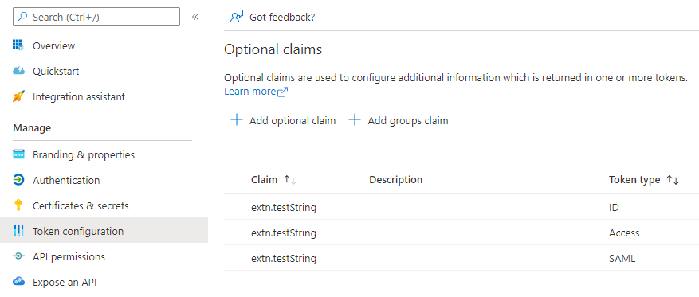
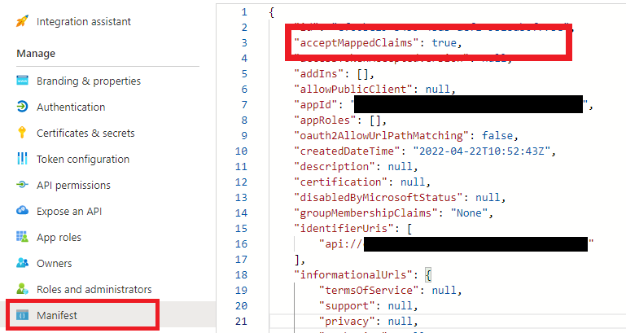
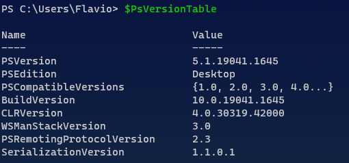

###### :postbox: Contact :brazil: :us: :fr:

[Twitter](https://twitter.com/campelo87)
[LinkedIn](https://www.linkedin.com/in/flavio-campelo/?locale=en_US)

---

# Adding custom claims to token

You can add custom claims to token. Here we'll show you how you can do it.

## First Method

On **Token configuration**, add all optional claim you need.



Set acceptMappedClaims to true in the application registration manifest in Azure.



Original claims

```json
{
    "aud": "xxxxxx-xxxxxx",
    "iss": "https://login.microsoftonline.com/xxxxxx-xxxxxx/v2.0",
    "iat": 1651237210,
    "nbf": 1651237210,
    "exp": 1651241110,
    "name": "Carlos Trump",
    "nonce": "xxxxxx-xxxxxx",
    "oid": "xxxxxx-xxxxxx",
    "preferred_username": "Carlos@xxxxxx.onmicrosoft.com",
    "rh": "0.AXYAqOdw6jRZRkSWfP72hzb6eT8SDlNWZqdPqMc67VBLYYiZAB4.",
    "sub": "zuB5I9MCoF1qr-crecx909wvV5P9YActkklSSJD8AV4",
    "tid": "xxxxxx-xxxxxx",
    "uti": "fzv0cbl8Skai4_NzlvlpAA",
    "ver": "2.0"
}
```

With base attributes

```json
{
    "aud": "xxxxxx-xxxxxx",
    "iss": "https://login.microsoftonline.com/xxxxxx-xxxxxx/v2.0",
    "iat": 1651258028,
    "nbf": 1651258028,
    "exp": 1651261928,
    "aio": "ATQAy/8TAAAAk4vHaYNEYYdk9mGabVnZU3k7irtTt8kN9nSCwi33t2WnUZQ+wfVqhmfagvrEDaFl",
    "name": "Carlos Trump",
    "nonce": "xxxxxx-xxxxxx",
    "oid": "xxxxxx-xxxxxx",
    "preferred_username": "Carlos@xxxxxx.onmicrosoft.com",
    "rh": "0.AXYAqOdw6jRZRkSWfP72hzb6eQ2WycEzZuJOvIt24Do6O26ZAB4.",
    "sub": "HZpJ82-w-xbNiIIZO4rbPyMLwespkL6vImL3tjtjWfQ",
    "tid": "xxxxxx-xxxxxx",
    "uti": "ei9kLnvfnUW37Vn--2SUAA",
    "ver": "2.0",
    "country": "CA"
}
```

With extension attributes

```json
{
    "aud": "xxxxxx-xxxxxx",
    "iss": "https://login.microsoftonline.com/xxxxxx-xxxxxx/v2.0",
    "iat": 1651264242,
    "nbf": 1651264242,
    "exp": 1651268142,
    "aio": "ATQAy/8TAAAAewvv7oKplIyMzAwyQB1cJQtJ5AxLPwkQqAtvthJuBannRHsbRqiqXPpIWalURrbA",
    "extn.testString": [
        "my string value"
    ],
    "name": "Carlos Trump",
    "nonce": "xxxxxx-xxxxxx",
    "oid": "xxxxxx-xxxxxx",
    "preferred_username": "Carlos@xxxxxx.onmicrosoft.com",
    "rh": "0.AXYAqOdw6jRZRkSWfP72hzb6eQ2WycEzZuJOvIt24Do6O26ZAB4.",
    "sub": "HZpJ82-w-xbNiIIZO4rbPyMLwespkL6vImL3tjtjWfQ",
    "tid": "xxxxxx-xxxxxx",
    "uti": "HX0mTfONKEKwFXRbx76SAA",
    "ver": "2.0"
}
```

## Second Method

AzureAD and AzureADPreview Module don't work with PowerShell v7.x

Verify your powershell version

```powershell
$PSVersionTable
```


If you're not running 5.1 version, you should use this command

```powershell
PowerShell -version 5.1
```

Then confirm you're using the correct version

```powershell
$PSVersionTable
```



> IMPORTANT
> You have to use **AzureADPreview** because **AzureAD** doesn't have several commands.

```powershell
Install-Module AzureADPreview
Import-Module AzureADPreview
Connect-AzureAD -tenantId {TENANT_ID}
```

```powershell
Get-AzureADPolicy

New-AzureADPolicy -Definition @('{"ClaimsMappingPolicy":{"Version":1,"IncludeBasicClaimSet":"true", "ClaimsSchema": [{"Source":"user","ID":"employeeid","SamlClaimType":"http://schemas.xmlsoap.org/ws/2005/05/identity/claims/employeeid","JwtClaimType":"employeeid"},{"Source":"company","ID":"tenantcountry","SamlClaimType":"http://schemas.xmlsoap.org/ws/2005/05/identity/claims/country","JwtClaimType":"country"}]}}') -DisplayName "ExtraClaimsExample" -Type "ClaimsMappingPolicy"

# for extension attributes
New-AzureADPolicy -Definition @('{"ClaimsMappingPolicy":{"Version":1,"IncludeBasicClaimSet":"true", "ClaimsSchema": [{"Source":"user","ExtensionID":"extension_{CLIENT_ID}_testString","JwtClaimType":"extTestString"}]}}') -DisplayName "ExtraClaimsExample" -Type "ClaimsMappingPolicy"

Remove-AzureADPolicy -Id {POLICY_ID}
```

> IMPORTANT
> - For extension attributes, you have to use ExtensionID instead of ID
> - ExtensionID values are case sensitives.

Get Service Principal ObjectID

```powershell
Get-AzureADServicePrincipal -SearchString {APP_REGISTRATION_NAME}
```

Applying the policy to Service Principal

```powershell
Add-AzureADServicePrincipalPolicy -Id {SERVICE_PRINCIPAL_OBJECT_ID} -RefObjectId {POLICY_ID}
```

Adding new application key

```powershell
New-AzureADApplicationKeyCredential -ObjectId {APPLICATION_OBJECT_ID} -CustomKeyIdentifier "Test" -StartDate "4/29/2022" -Type "Symmetric" -Usage "Sign" -Value "123"
```

- **APPLICATION_OBJECT_ID** => This value is available on *App registrations overview's page.*

## Source
- [Customize claims](https://docs.microsoft.com/en-us/azure/active-directory/develop/active-directory-claims-mapping)
- [Optional claims](https://docs.microsoft.com/en-us/azure/active-directory/develop/active-directory-optional-claims)

## Typos or suggestions?

If you've found a typo, a sentence that could be improved or anything else that should be updated on this blog post, you can access it through a git repository and make a pull request. If you feel comfortable with github, instead of posting a comment, please go directly to https://github.com/campelo/documentation and open a new pull request with your changes.