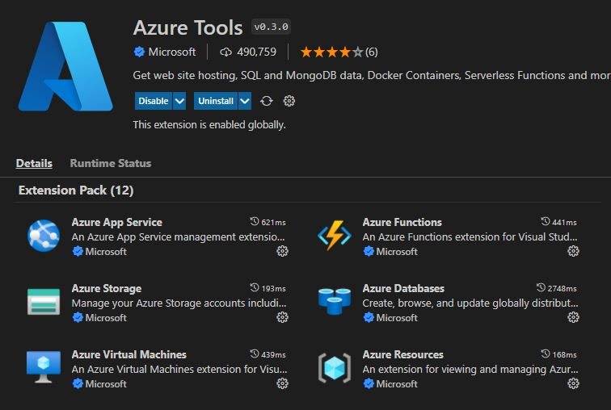

###### :postbox: Contact :brazil: :us: :fr:

[Twitter](https://twitter.com/campelo87)
[LinkedIn](https://www.linkedin.com/in/flavio-campelo/?locale=en_US)

---

## Creating a Function App

Once you're connected on [Azure Portal](https://portal.azure.com/), you can create a new *Function App*. 

I recommend to user *Consumption plan* for your new function because it's included on Microsoft's limited free services.

## Installing extensions on Visual Studio Code

It's recommended to install [Azure Tools](https://marketplace.visualstudio.com/items?itemName=ms-vscode.vscode-node-azure-pack) on your VS Code that will connect with your Azure account to make easy to interact with Azure Cloud Services



> [!OPTIONAL] 
> You could install [Azure Functions Core Tools](https://docs.microsoft.com/en-us/azure/azure-functions/functions-run-local?tabs=v4%2Cwindows%2Ccsharp%2Cportal%2Cbash)

## Creating secrets

```powershell
dotnet user-secrets init 
```

This step will create a folder on **%APPDATA%\Microsoft\UserSecrets** and this folder name will be added on your .csproj file in a UserSecretsId tag.

```xml
<Project Sdk="Microsoft.NET.Sdk">
  <PropertyGroup>
    <TargetFramework>net6.0</TargetFramework>
    <AzureFunctionsVersion>v4</AzureFunctionsVersion>
    <UserSecretsId>12345678-1234-1234-1234-1234567890ab</UserSecretsId>
  </PropertyGroup>
  
  ...

</Project>
```

Then you can add new values to your secret

```powershell
dotnet user-secrets set tenantId "MY_TENANT_ID"
dotnet user-secrets set clientId "MY_CLIENT_ID"
dotnet user-secrets set clientSecret "MY_CLIENT_SECRET"
```

**MY_TENANT_ID** => It's a GUID value like '12345678-1234-1234-1234-1234567890ab'. You can get this value on your tenant's overview page. https://aad.portal.azure.com/
**MY_CLIENT_ID** => It's a GUID value like '12345678-1234-1234-1234-1234567890ab'. You can get this value on your app registration's overview page. https://portal.azure.com/
**MY_CLIENT_SECRET** => It's like an ecrypted password Q~nfpjRObkLeRjQsyD. You can get this value once when you create a new client secret on your app registration's page. https://portal.azure.com/

Then your values will be kept in a **secrets.json** file

```json
{
  "tenantId": "12345678-1234-1234-1234-1234567890ab",
  "clientId": "12345678-1234-1234-1234-1234567890ab",
  "clientSecret": "Q~nfhpjRgObkjLeRmjQTsryD"
}
```

## Dependency Injection

### Prerequisites

Before you can use dependency injection, you must install the following NuGet packages:

- [Microsoft.Azure.Functions.Extensions](https://www.nuget.org/packages/Microsoft.Azure.Functions.Extensions/)

- [Microsoft.NET.Sdk.Functions](https://www.nuget.org/packages/Microsoft.NET.Sdk.Functions/) package version 1.0.28 or later

- [Microsoft.Extensions.DependencyInjection](https://www.nuget.org/packages/Microsoft.Extensions.DependencyInjection/) (currently, only version 2.x or later supported)


### Creating Startup Class

You should create a startup class to configure all of your dependencies.

```C#
using Microsoft.Azure.Functions.Extensions.DependencyInjection;
using Microsoft.Extensions.DependencyInjection;

[assembly: FunctionsStartup(typeof(MyNamespace.Startup))]

namespace MyNamespace
{
    public class Startup : FunctionsStartup
    {
        public override void Configure(IFunctionsHostBuilder builder)
        {
            builder.Services.AddTransient<IMyTransientService, MyTransientService>();
            builder.Services.AddScoped<IMyScopedService, MyScopedService>();
            builder.Services.AddSingleton<IMySingletonService, MySingletonService>();
        }
    }
}
```

### Creating your Interfaces and Implementations

Now, you can create all new interfaces and their implementations.

**IMyTransientService.cs**

```C#
using System.Threading.Tasks;

namespace MyNamespace
{
  public interface IMyTransientService
    {
        Task DoSomething();
    }
}
```

**MyTransientService.cs**

```C#
using System.Net.Http.Headers;
using System.Threading.Tasks;
using Microsoft.Graph;
using Microsoft.Identity.Client;

namespace MyNamespace
{
  public class MyTransientService : IMyTransientService
  {
    public async Task DoSomething()
    {
      // your implementation here...
    }
  }
}
```

### Using your classes by DI

Then you can use your injected object as usual.

```C#
using Microsoft.AspNetCore.Http;
using Microsoft.AspNetCore.Mvc;
using Microsoft.Azure.WebJobs;
using Microsoft.Azure.WebJobs.Extensions.Http;
using Microsoft.Extensions.Configuration;
using Microsoft.Extensions.Logging;
using System.Threading.Tasks;

namespace MyNamespace
{
  public class FunctionForTest
  {
    private readonly IConfiguration _configuration;
    private readonly IMyTransientService _myTransientService;

    public FunctionForTest(IConfiguration configuration, IMyTransientService myTransientService)
    {
      _configuration = configuration;
      _myTransientService = myTransientService;
    }

    [FunctionName("FunctionForTest")]
    public async Task<IActionResult> Run(
        [HttpTrigger(AuthorizationLevel.Anonymous, "get", "post", Route = null)] HttpRequest req,
        ILogger log)
    {
      log.LogInformation("C# HTTP trigger FunctionForTest processed a request.");

      string qParam = req.Query["qParam"];
      
      // your code here...

      await this._myTransientService.DoSomething();

      return new OkObjectResult("Action finished!");
    }
  }
}
```

## To read about
- **knownClientApplications** in manifest

## Sources
[Dependency Injection in Azure Functions](https://docs.microsoft.com/en-us/azure/azure-functions/functions-dotnet-dependency-injection)
[Build Azure Functions with Microsoft Graph](https://docs.microsoft.com/en-us/graph/tutorials/azure-functions)
[App Secrets](https://docs.microsoft.com/en-us/aspnet/core/security/app-secrets)
[Azure Key Vault](https://docs.microsoft.com/en-us/azure/key-vault/general/overview)

## Typos or suggestions?

If you've found a typo, a sentence that could be improved or anything else that should be updated on this blog post, you can access it through a git repository and make a pull request. If you feel comfortable with github, instead of posting a comment, please go directly to https://github.com/campelo/documentation and open a new pull request with your changes.