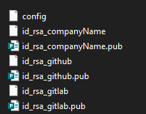

###### :postbox: Contact :brazil: :us: :fr:

[Twitter](https://twitter.com/campelo87)
[LinkedIn](https://www.linkedin.com/in/flavio-campelo/?locale=en_US)

---

Generate a new SSH key:

```bash
ssh-keygen -t rsa -C "your_name@mail.com"
```

## On Windows

Add a new **config** file under %USERPROFILE%\\.ssh folder

```
Host gitlab.com
	HostName gitlab.com
	IdentityFile ~/.ssh/id_rsa_gitlab
	User YourName
Host github.com
	HostName github.com
	IdentityFile ~/.ssh/id_rsa_github
	User naYourNameme
Host gist.github.com
	HostName gist.github.com
	IdentityFile ~/.ssh/id_rsa_github
	User YourName
Host ssh.dev.azure.com
	HostName ssh.dev.azure.com
	IdentityFile ~/.ssh/id_rsa_companyName
	User YourName
```

Your .ssh folder will look like this:



## Typos or suggestions?

If you've found a typo, a sentence that could be improved or anything else that should be updated on this blog post, you can access it through a git repository and make a pull request. If you feel comfortable with github, instead of posting a comment, please go directly to https://github.com/campelo/documentation and open a new pull request with your changes.