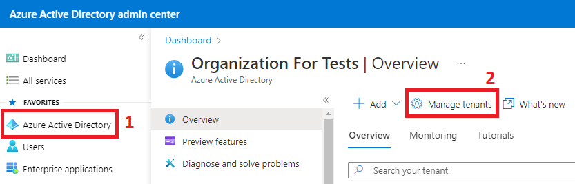
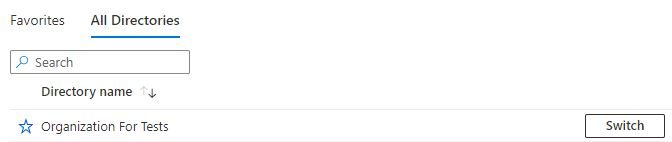

###### :postbox: Contact :brazil: :us: :fr:

[Twitter](https://twitter.com/campelo87)
[LinkedIn](https://www.linkedin.com/in/flavio-campelo/?locale=en_US)

---

## Creating a new tenant

- Go to [Azure Active Directory Admin Center](https://aad.portal.azure.com/) 
- Click on **Azure Active Directory > Manage Tenants**

- Click on **Create** button to create a new tenant.

## Using a new tenant

- Go to [Azure Portal](https://portal.azure.com)
- Click on **Directories + Subscriptions** on top bar

- Click on **Switch** button of your new tenant

Now you're able to use all Azure resources in your new tenant.

## Typos or suggestions?

If you've found a typo, a sentence that could be improved or anything else that should be updated on this blog post, you can access it through a git repository and make a pull request. If you feel comfortable with github, instead of posting a comment, please go directly to https://github.com/campelo/documentation and open a new pull request with your changes.
