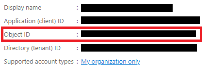

###### :postbox: Contact :brazil: :us: :fr:

[Twitter](https://twitter.com/campelo87)
[LinkedIn](https://www.linkedin.com/in/flavio-campelo/?locale=en_US)

---

# Creating AD users' extension properties 

## Required permission

You need to allow this permission for on your app registration page.

- Application.ReadWrite.All

## Creating extension property

You have to get your application's ObjectId from the overview's page



Then you can make a POST request to this url to create a new extension property.

```
https://graph.microsoft.com/v1.0/applications/{APPLICATION_OBJECT_ID}/extensionProperties
```

```json
{
    "name": "testString",
    "dataType": "String",
    "targetObjects": [
        "User"
    ]
}
```

Your response should look like this

```json
{
    "@odata.context": "https://graph.microsoft.com/v1.0/$metadata#applications({APPLICATION_OBJECT_ID})/extensionProperties/$entity",
    "id": "fa613ce9-164b-40ca-bf68-276195a1888c",
    "deletedDateTime": null,
    "appDisplayName": "My Application Name",
    "dataType": "String",
    "isSyncedFromOnPremises": false,
    "name": "extension_{APPLICATION_ID}_testString",
    "targetObjects": [
        "User"
    ]
}
```

## Updating an AD user

Now, you can make a PATCH request to user's endpoint.

```
https://graph.microsoft.com/v1.0/users/{USER_ID}
```

with this content 

```json
{
    "extension_{APPLICATION_ID}_testString": "my test string"
}
```

## Getting new extention from user

You can get the new information from users

```
https://graph.microsoft.com/v1.0/users?$select=displayName,extension_{APPLICATION_ID}_testString
```

Response

```json
{
    "@odata.context": "https://graph.microsoft.com/v1.0/$metadata#users(displayName,extension_{APPLICATION_ID}_testString)",
    "value": [
        {
            "displayName": "Bill Musk",
            "extension_{APPLICATION_ID}_testString": "my test string"
        }
    ]
}
```

## Source
- [Create extensionProperty](https://docs.microsoft.com/en-us/graph/api/application-post-extensionproperty)

## Typos or suggestions?

If you've found a typo, a sentence that could be improved or anything else that should be updated on this blog post, you can access it through a git repository and make a pull request. If you feel comfortable with github, instead of posting a comment, please go directly to https://github.com/campelo/documentation and open a new pull request with your changes.
