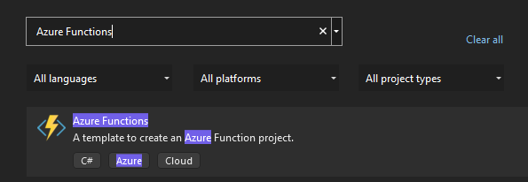

###### :postbox: Contact :brazil: :us: :fr:

[Twitter](https://twitter.com/campelo87)
[LinkedIn](https://www.linkedin.com/in/flavio-campelo/?locale=en_US)

---

# Creating a Function App

Once you're connected on [Azure Portal](https://portal.azure.com/), you can create a new *Function App*. 

I recommend to user *Consumption plan* for your new function because it's included on Microsoft's limited free services.

## Using Visual Studio Code

### Installing extensions on Visual Studio Code

It's recommended to install [Azure Tools](https://marketplace.visualstudio.com/items?itemName=ms-vscode.vscode-node-azure-pack) on your VS Code that will connect with your Azure account to make easy to interact with Azure Cloud Services


> @ icon-info-circle 
> You could install [Azure Functions Core Tools](https://docs.microsoft.com/en-us/azure/azure-functions/functions-run-local?tabs=v4%2Cwindows%2Ccsharp%2Cportal%2Cbash)

### Creating a local function

So you can click on create a new function and choose some information for your new function.


For our test we've choosen the following values:

- Language **C#**
- .NET runtime **.NET 6**
- Template **HTTP trigger**
- Name *you can choose the name that you want*
- Namespace *you can choose the namespace that you want*
- Aythorization level **Anonymous**
- How do you like to open your project **Add to workspace**

## Using Visual Studio

### Creating a local function

Click on *File > New > Project*


And search for *Azure Functions*



Fill out all required information for your new function. For our example we'll use *HTTP trigger* and *Anonymous* authorization.

> @icon-info-circle 
> You can find more information about function triggers [here](https://docs.microsoft.com/en-us/azure/azure-functions/functions-triggers-bindings) and information about Authorization [here](https://docs.microsoft.com/en-us/azure/azure-functions/functions-bindings-http-webhook-trigger?tabs=in-process%2Cfunctionsv2&pivots=programming-language-csharp#authorization-keys).

## Running the function

Now you are able to run your new function. You can hit **F5** for that and you'll see some message like that


You can open your browser and navigate to this endpoint

```
http://localhost:7071/api/Function1?name=Flavio
```


## Source
- [Creating functions with VS code](https://docs.microsoft.com/en-us/azure/azure-functions/create-first-function-vs-code-csharp)
- [Creating functions with VS](https://docs.microsoft.com/en-us/azure/azure-functions/functions-create-your-first-function-visual-studio)

## Typos or suggestions?

If you've found a typo, a sentence that could be improved or anything else that should be updated on this blog post, you can access it through a git repository and make a pull request. If you feel comfortable with github, instead of posting a comment, please go directly to https://github.com/campelo/documentation and open a new pull request with your changes.
