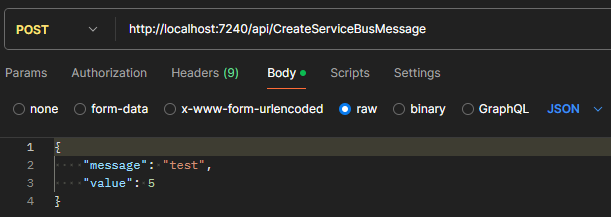
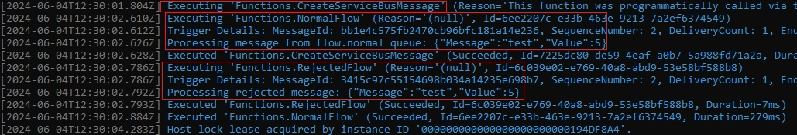

###### :postbox: Contact :brazil: :us: :fr:

[Twitter](https://twitter.com/campelo87)
[LinkedIn](https://www.linkedin.com/in/flavio-campelo/?locale=en_US)

---

# Azure Service Bus and Azure Functions Integration

This documentation provides a step-by-step guide on how to create and configure an Azure Service Bus and implement Azure Functions to send and process messages using dependency injection.

## Prerequisites
- Azure Subscription
- Visual Studio or Visual Studio Code
- Azure Functions Core Tools
- .NET Core SDK

## Steps

### 1. Create Azure Service Bus

#### Using Azure Portal

1. Create a Service Bus Namespace:

    a. Go to the Azure portal and click on "Create a resource".
    
    b. Search for "Service Bus" and click "Create".
    
    c. Fill in the necessary details:
    
        - Name: Enter a unique name for the namespace.

        - Region: Select your preferred region.

        - Pricing tier: Choose the appropriate pricing tier.

    d. Click "Review + create" and then "Create".

2. Create Queues in the Namespace:

    a. After the namespace is created, navigate to it.

    b. In the left-hand menu, select "Queues" and click "+ Queue" at the top.

    c. Fill in the queue details:

        - Name: flow.normal

        - Configure additional settings as needed or leave default values.

    d. Click "Create".

    e. Repeat the process to create a queue named flow.rejected.

#### Using Azure CLI

1. Log in to Azure:
```sh
az login
```

2. Create a Service Bus Namespace:

```sh
az servicebus namespace create --resource-group <ResourceGroupName> --name <NamespaceName> --location <Region>
```

3. Create Queues:

```sh
az servicebus queue create --resource-group <ResourceGroupName> --namespace-name <NamespaceName> --name flow.normal
az servicebus queue create --resource-group <ResourceGroupName> --namespace-name <NamespaceName> --name flow.rejected
```


### 2. Create Azure Functions

#### Create a New Azure Functions Project

1. Open Visual Studio or Visual Studio Code and create a new Azure Functions project:

```sh
func init MyFunctionApp --dotnet
cd MyFunctionApp
func new --name CreateServiceBusMessage --template "HTTP trigger" --authlevel "anonymous"
func new --name NormalFlow --template "Queue trigger" --queueName "flow.normal"
func new --name RejectedFlow --template "Queue trigger" --queueName "flow.rejected"
```

2. Add Necessary Packages:

Add the following packages to your .csproj file:

- Microsoft.Azure.Functions.Extensions
- Microsoft.Extensions.DependencyInjection
- Azure.Messaging.ServiceBus

3. Register ServiceBusClient in services:

Add ServiceBusClient as service in Program.cs class:

```csharp
// ... 
var host = new HostBuilder()
    .ConfigureServices((builderContext, services) =>
    {

        services
        // add this line...
            .AddSingleton<ServiceBusClient>(new ServiceBusClient(Environment.GetEnvironmentVariable("ServiceBusConnectionString")));
    })
    .ConfigureFunctionsWorkerDefaults()
    .Build();
// ...
```

4. Create a MyMessage class:

```csharp
public class MyMessage
{
    public string Message { get; set; }
    public int Value { get; set; }
}
```

5. Implement the Functions:

Create the functions CreateServiceBusMessage, NormalFlow, and RejectedFlow.

```csharp
[Function(nameof(CreateServiceBusMessage))]
    public async Task<HttpResponseData> CreateServiceBusMessage(
        [HttpTrigger(AuthorizationLevel.Anonymous, "post", Route = "CreateServiceBusMessage")]
        HttpRequestData req,
        FunctionContext executionContext)
    {
        var logger = executionContext.GetLogger("CreateServiceBusMessage");
        string requestBody = await new StreamReader(req.Body).ReadToEndAsync();
        MyMessage message = JsonConvert.DeserializeObject<MyMessage>(requestBody);

        if (message == null || string.IsNullOrEmpty(message.Message))
        {
            var badResponse = req.CreateResponse(System.Net.HttpStatusCode.BadRequest);
            badResponse.WriteString("Invalid message");
            return badResponse;
        }

        ServiceBusSender sender = serviceBusClient.CreateSender("flow.normal");

        try
        {
            await sender.SendMessageAsync(new ServiceBusMessage(JsonConvert.SerializeObject(message)));
            var response = req.CreateResponse(System.Net.HttpStatusCode.OK);
            response.WriteString("Message sent to Service Bus");
            return response;
        }
        catch (Exception ex)
        {
            logger.LogError($"Error sending message: {ex.Message}");
            var errorResponse = req.CreateResponse(System.Net.HttpStatusCode.InternalServerError);
            errorResponse.WriteString("Failed to send message");
            return errorResponse;
        }
        finally
        {
            await sender.DisposeAsync();
        }
    }

    [Function("NormalFlow")]
    public async Task NormalFlow(
        [ServiceBusTrigger("flow.normal", Connection = "ServiceBusConnectionString")]
        string myQueueItem, FunctionContext executionContext)
    {
        var logger = executionContext.GetLogger("NormalFlow");
        logger.LogInformation("Processing message from flow.normal queue: {myQueueItem}", myQueueItem);

        // For demonstration, we'll move the message to rejected queue if value is less than 10
        MyMessage message = JsonConvert.DeserializeObject<MyMessage>(myQueueItem);
        if (message != null && message.Value < 10)
        {
            ServiceBusSender sender = serviceBusClient.CreateSender("flow.rejected");
            try
            {
                await sender.SendMessageAsync(new ServiceBusMessage(myQueueItem));
            }
            catch (Exception ex)
            {
                logger.LogError("Error moving message to flow.rejected queue: {message}", ex.Message);
            }
            finally
            {
                await sender.DisposeAsync();
            }
        }
    }

    [Function("RejectedFlow")]
    public async Task RejectedFlow(
        [ServiceBusTrigger("flow.rejected", Connection = "ServiceBusConnectionString")]
        string myQueueItem, FunctionContext executionContext)
    {
        var logger = executionContext.GetLogger("RejectedFlow");
        logger.LogInformation("Processing rejected message: {myQueueItem}", myQueueItem);
    }
```

6. Add ServiceBus conneciton string:

In your local.settings.json file, add a new environment variable to connect to ServiceBus:
```json
{
  "IsEncrypted": false,
  "Values": {
	... // other environment variables
	"ServiceBusConnectionString": "Endpoint=sb://my-service-bus.servicebus.windows.net/;SharedAccessKeyName=RootManageSharedAccessKey;SharedAccessKey=MY_SECRET_KEY"
  }
}
```

### 3. Run and Test the Functions
1. Run the Project:
Run the project in Visual Studio.

2. Test CreateServiceBusMessage:
Use a tool like Postman to send a POST request to the URL of the CreateServiceBusMessage function with a JSON body:

```json
{
    "message": "Test message",
    "value": 5
}
```



3. Verify Processing of NormalFlow and RejectedFlow:

Check the logs for the NormalFlow and RejectedFlow functions to confirm that the messages are being processed correctly.



With these steps, you have successfully created and configured an Azure Service Bus and implemented Azure Functions to send and process messages using dependency injection.

## Source code
[Sample code](https://github.com/campelo/AzureFunctionsSample)

## Typos or suggestions?

If you've found a typo, a sentence that could be improved or anything else that should be updated on this blog post, you can access it through a git repository and make a pull request. If you feel comfortable with github, instead of posting a comment, please go directly to https://github.com/campelo/documentation and open a new pull request with your changes.
