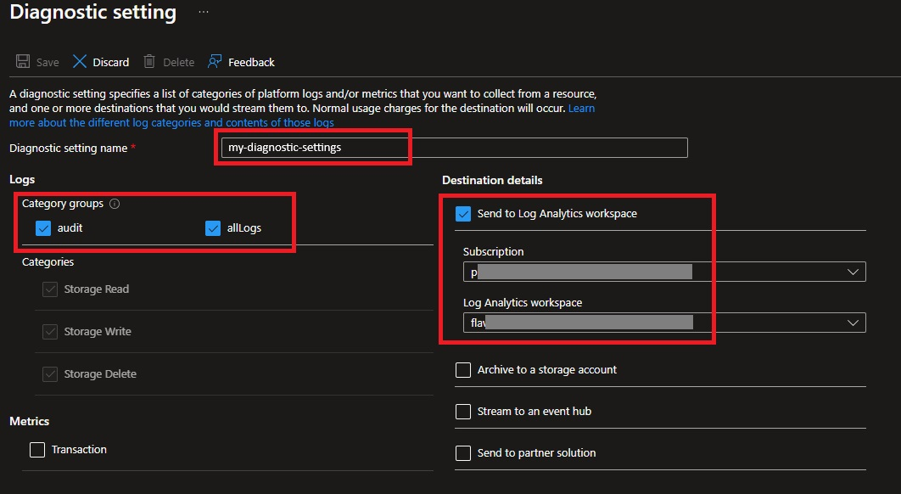
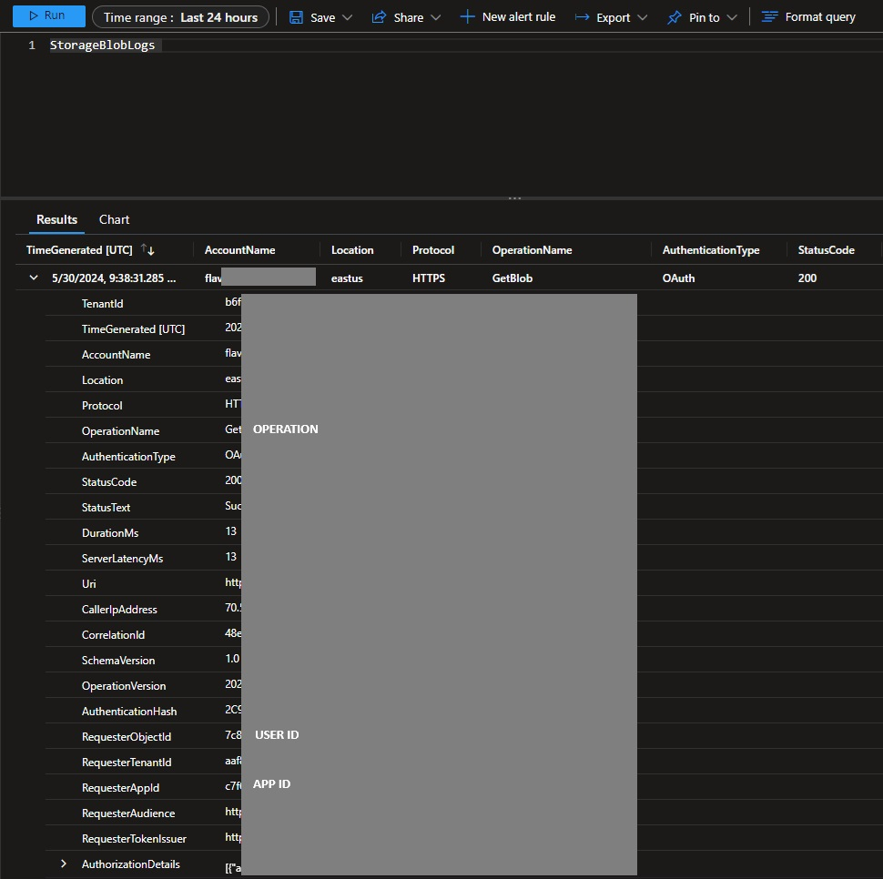

###### :postbox: Contact :brazil: :us: :fr:

[Twitter](https://twitter.com/campelo87)
[LinkedIn](https://www.linkedin.com/in/flavio-campelo/?locale=en_US)

# Setting Up Front-End and Back-End Applications with Azure Blob Storage Access

This document provides a step-by-step guide to configure Front-End (FE) and Back-End (BE) applications to access Azure Blob Storage using the On-Behalf-Of (OBO) flow.

## Prerequisites

- Azure Subscription
- Azure CLI
- Visual Studio or any C# development environment

## Steps

### 1. Register Back-End (BE) Application in Azure AD

1. **Register the BE Application:**
   - Navigate to "Microsoft Entra ID" > "App registrations".
   - Click on "New registration".
   - Note the `Application (client) ID` and `Directory (tenant) ID`.

2. **Add Client Secret:**
   - Go to "Certificates & secrets".
   - Add a new client secret and note it down.

3. **Expose API:**
   - Go to "Expose an API".
   - Add a new scope, e.g., `api://{client_id_be}/user_impersonation`.

4. **Add API Permissions:**
   - Go to "API Permissions".
   - Add delegated and application permissions for `https://storage.azure.com/.default`.

### 2. Register Front-End (FE) Application in Azure AD

1. **Register the FE Application:**
   - Navigate to "Microsoft Entra ID" > "App registrations".
   - Click on "New registration".
   - For this sample we are using mobile and desktop applications.
   - Note the `Application (client) ID` and `Directory (tenant) ID`.

2. **Configure Redirect URI:**
   - Go to "Authentication" under the FE application.
   - Add a Redirect URI (e.g., `http://localhost`).

3. **Add API Permissions:**
   - Go to "API Permissions".
   - Click on "Add a permission".
   - Select "Microsoft Graph" and add delegated permissions such as `user.read`.
   - Click on "Add a permission" again.
   - Select "APIs My organization uses" and find the BE application.
   - Add the delegated permission `api://{client_id_be}/user_impersonation`.

4. **Grant Admin Consent:**
   - Ensure admin consent is granted for the added permissions.

### 3. Configure Azure Blob Storage

1. **Create a Storage Account:**
   - Navigate to "Storage accounts" and create a new storage account.
   - Note the storage account name.

2. **Create a Container:**
   - Inside the storage account, create a new container.
   - Note the container name.

3. **Assign Roles:**
   - Go to the storage account.
   - Navigate to "Access Control (IAM)".
   - Click on "Add role assignment".
   - Assign roles like `Storage Blob Data Reader` or `Storage Blob Data Contributor` to the appropriate users or service principals.

4. **Enable logging in Azure Storage Container:**
   - Go to the storage account.
   - Navigate to "Diagnostics settings".
   - Click on the resource to view diagnostic settings.
   - Click on "Add diagnostic setting".
   - Select "StorageAccountLog" and "Blob".
   - Click on "Review + create" and then "Create".
   - This will enable logging for the Azure Storage Container.



### 4. Implement the Code

This sample uses a console application for demo purposes only. After creating a new application, you have to install these nuget packages.
```
Azure.Storage.Blobs
Microsoft.Identity.Client
```

You can get the sample code [here](https://github.com/campelo/obo-blob-storage).

```csharp
using Azure.Core;
using Azure.Storage.Blobs;
using Microsoft.Identity.Client;
using System;
using System.Threading;
using System.Threading.Tasks;

string tenantId = "tenant_id";

// FE
string clientIdFE = "fe_id";
string[] scopesFE = { "user.read", "api://be_id/user_impersonation" };

// BE
string clientIdBE = "be_id";
string clientSecretBE = "be_secret";
string[] scopesBE = new[] { "https://storage.azure.com/.default" };

// BLOB
string storageAccountName = "storage_name";
string containerName = "container_name";
string blobName = "blob_name";

string userAccessToken = await GetUserAccessTokenAsync();
Console.WriteLine($"User Access Token: {userAccessToken}");

string oboToken = await GetOboTokenAsync(userAccessToken);
Console.WriteLine($"OBO Token: {oboToken}");

await AccessBlobStorageAsync(oboToken);

async Task<string> GetUserAccessTokenAsync()
{
    var app = PublicClientApplicationBuilder.Create(clientIdFE)
        .WithAuthority(new Uri($"https://login.microsoftonline.com/{tenantId}"))
        .WithRedirectUri("http://localhost")
        .Build();

    var accounts = await app.GetAccountsAsync();
    AuthenticationResult result;

    try
    {
        result = await app.AcquireTokenSilent(scopesFE, accounts.FirstOrDefault())
            .ExecuteAsync();
    }
    catch (MsalUiRequiredException)
    {
        result = await app.AcquireTokenInteractive(scopesFE)
            .ExecuteAsync();
    }

    return result.AccessToken;
}

async Task<string> GetOboTokenAsync(string userAccessToken)
{
    var confidentialClient = ConfidentialClientApplicationBuilder.Create(clientIdBE)
        .WithClientSecret(clientSecretBE)
        .WithAuthority(new Uri($"https://login.microsoftonline.com/{tenantId}"))
        .Build();

    var oboResult = await confidentialClient.AcquireTokenOnBehalfOf(scopesBE, new UserAssertion(userAccessToken))
        .ExecuteAsync();

    return oboResult.AccessToken;
}

async Task AccessBlobStorageAsync(string oboToken)
{
    TokenCredential tokenCredential = new ObTokenCredential(oboToken);
    BlobServiceClient blobServiceClient = new BlobServiceClient(new Uri($"https://{storageAccountName}.blob.core.windows.net"), tokenCredential);
    BlobContainerClient containerClient = blobServiceClient.GetBlobContainerClient(containerName);
    BlobClient blobClient = containerClient.GetBlobClient(blobName);

    var response = await blobClient.DownloadAsync();
    using (var stream = response.Value.Content)
    {
        Console.WriteLine("Blob content read successfully.");
    }
}

class ObTokenCredential : TokenCredential
{
    private readonly string _token;

    public ObTokenCredential(string token)
    {
        _token = token;
    }

    public override AccessToken GetToken(TokenRequestContext requestContext, CancellationToken cancellationToken)
    {
        return new AccessToken(_token, DateTimeOffset.MaxValue);
    }

    public override ValueTask<AccessToken> GetTokenAsync(TokenRequestContext requestContext, CancellationToken cancellationToken)
    {
        return new ValueTask<AccessToken>(new AccessToken(_token, DateTimeOffset.MaxValue));
    }
}
```

### 5. Check OBO and logs

Run the code and check the logs to see all information about who accessed the file.



## Conclusion
By following these steps, you can configure FE and BE applications to access Azure Blob Storage using the On-Behalf-Of (OBO) flow. Ensure all permissions and configurations are correctly set in Azure AD and the Blob Storage account.

---

## Typos or suggestions?

If you've found a typo, a sentence that could be improved or anything else that should be updated on this blog post, you can access it through a git repository and make a pull request. If you feel comfortable with github, instead of posting a comment, please go directly to https://github.com/campelo/documentation and open a new pull request with your changes.