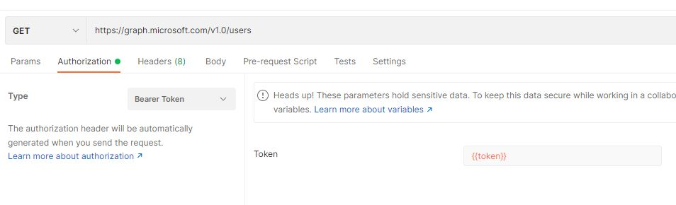

###### :postbox: Contact :brazil: :us: :fr:

[Twitter](https://twitter.com/campelo87)
[LinkedIn](https://www.linkedin.com/in/flavio-campelo/?locale=en_US)

---

## Register a new application

- Go to [Azure portal](https://portal.azure.com/)
- Open **App registrations**
- Click on **New registration**
- Fill out the basic informations and add a callback url for **Redirect URI** as web application. (It's necessary to grant access later).

We inserted a postman's callback url, but you should use your application's callback url.
```
https://www.getpostman.com/oauth2/callback
```


- On **API permissions** add and grant permission to Microsoft Graph **User.Read.All** as application permission and remove **User.Read**


- Add a new client secret on **Certifiates & secrets** and copy and hold the client secret value, it's showed once only and it'll be necessary later.


- Go to overview and copy and keep **Application (client) ID** and **Directory (tenant) ID** values


## Consenting app permission

- Use your app information to go to this URL in a browser.

```
GET https://login.microsoftonline.com/{tenantId}/adminconsent
?client_id={applicationId}
&state=12345
&redirect_uri={redirectUri}
```

**tenantId** => Your tenant's ID. You can get this information on your application overview's page or in your tenant overview's page.
**applicationId** => Your application's ID. You can get this information on your application overview's page.
**redirect_uri** => The same application's callback url that you have put in callback url of your app. It must be exact the same of one of your app's callback url.

Here's a url sample
``` 
https://login.microsoftonline.com/00000-000-000-00000/adminconsent?client_id=00010001-001-001-00010001&state=12345&redirect_uri=https://www.getpostman.com/oauth2/callback
```

So, you be asked to grant permissions for your app.

## Testing your application

### Using postman

#### Getting token

Create a new **post request** to this URL.
```
https://login.microsoftonline.com/{tenantId}/oauth2/v2.0/token
```

with this **x-www-form-urlencoded** body
```
client_id={clientId}
scope=https://graph.microsoft.com/.default
client_secret={clientSecret}
grant_type=client_credentials
```

Then you can receive a response like that
```json
{
    "token_type": "Bearer",
    "expires_in": 3599,
    "ext_expires_in": 3599,
    "access_token": "eyJ0eXAiO... ..._f9iN-w"
}
```

Now you can use your **access_token** to make calls to Microsoft graph's API.

#### Calling users endpoint

Create a new **GET request** to this URL
```
https://graph.microsoft.com/v1.0/users
```

And add the bearer token authorization



When you send your request, you should receive a response with all registered users:
```json
{
    "@odata.context": "https://graph.microsoft.com/v1.0/$metadata#users",
    "value": [
        {
            "businessPhones": [],
            "displayName": "Bill Musk",
            "givenName": "Bill",
            "jobTitle": null,
            "mail": null,
            "mobilePhone": null,
            "officeLocation": null,
            "preferredLanguage": null,
            "surname": "Musk",
            "userPrincipalName": "Bill@myCompany.onmicrosoft.com",
            "id": "838cd9e3-48f5-41f8-0612-6bea2f4b06d7"
        },
        {
            "businessPhones": [],
            "displayName": "Elon Jordan",
            "givenName": "Elon",
            "jobTitle": null,
            "mail": null,
            "mobilePhone": null,
            "officeLocation": null,
            "preferredLanguage": null,
            "surname": "Jordan",
            "userPrincipalName": "Elon@myCompany.onmicrosoft.com",
            "id": "f002bcf8-41f8-0612-48f5-9fd8725e5340"
        }
        {
            "businessPhones": [],
            "displayName": "Michael Gates",
            "givenName": "Michael",
            "jobTitle": null,
            "mail": null,
            "mobilePhone": null,
            "officeLocation": null,
            "preferredLanguage": null,
            "surname": "Gates",
            "userPrincipalName": "michael@myCompany.onmicrosoft.com",
            "id": "41d7f802-48f5-0612-41f8-cd79b7bd6107"
        }
    ]
}
```

### Using CURL

#### Getting token

Make a call like that:
```bash
curl -X POST https://login.microsoftonline.com/{tenantId}/oauth2/v2.0/token -H "Content-type: application/x-www-form-urlencoded" -d "client_id={clientId}&scope=https://graph.microsoft.com/.default&client_secret={clientSecrect}&grant_type=client_credentials"
```

Then you can receive a response like that:
```json
{
    "token_type": "Bearer",
    "expires_in": 3599,
    "ext_expires_in": 3599,
    "access_token": "eyJ0eXAiO... ..._f9iN-w"
}
```

Now you can use your **access_token** to make calls to Microsoft graph's API.

#### Calling users endpoint

Make a call using the token that you've received

```bash
curl -X GET https://graph.microsoft.com/v1.0/users -H "Authorization: Bearer {access_token}"
```

And you'll receive a response like that:
```json
{
    "@odata.context": "https://graph.microsoft.com/v1.0/$metadata#users",
    "value": [
        {
            "businessPhones": [],
            "displayName": "Bill Musk",
            "givenName": "Bill",
            "jobTitle": null,
            "mail": null,
            "mobilePhone": null,
            "officeLocation": null,
            "preferredLanguage": null,
            "surname": "Musk",
            "userPrincipalName": "Bill@myCompany.onmicrosoft.com",
            "id": "838cd9e3-48f5-41f8-0612-6bea2f4b06d7"
        },
        {
            "businessPhones": [],
            "displayName": "Elon Jordan",
            "givenName": "Elon",
            "jobTitle": null,
            "mail": null,
            "mobilePhone": null,
            "officeLocation": null,
            "preferredLanguage": null,
            "surname": "Jordan",
            "userPrincipalName": "Elon@myCompany.onmicrosoft.com",
            "id": "f002bcf8-41f8-0612-48f5-9fd8725e5340"
        }
        {
            "businessPhones": [],
            "displayName": "Michael Gates",
            "givenName": "Michael",
            "jobTitle": null,
            "mail": null,
            "mobilePhone": null,
            "officeLocation": null,
            "preferredLanguage": null,
            "surname": "Gates",
            "userPrincipalName": "michael@myCompany.onmicrosoft.com",
            "id": "41d7f802-48f5-0612-41f8-cd79b7bd6107"
        }
    ]
}
```

## Sources
- [Register server app (get access without a user)](https://docs.microsoft.com/en-us/graph/auth-v2-service)
- [Microsoft Client Credentials flow](https://docs.microsoft.com/en-us/azure/active-directory/develop/v2-oauth2-client-creds-grant-flow)

## Typos or suggestions?

If you've found a typo, a sentence that could be improved or anything else that should be updated on this blog post, you can access it through a git repository and make a pull request. If you feel comfortable with github, instead of posting a comment, please go directly to https://github.com/campelo/documentation and open a new pull request with your changes.
