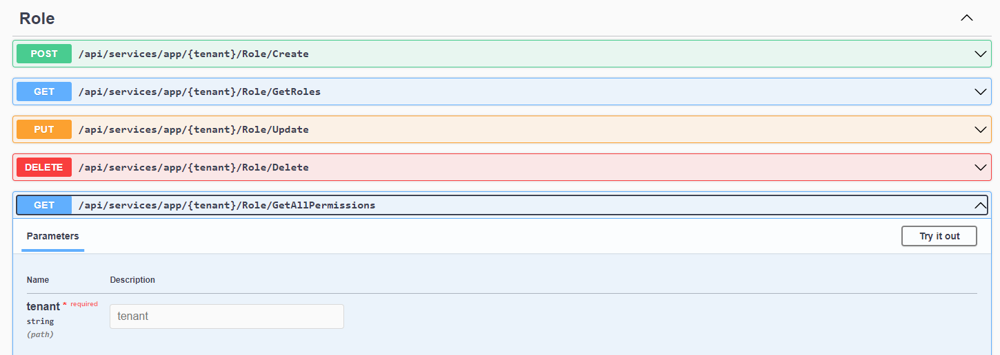

###### :postbox: Contact :brazil: :us: :fr:

[Twitter](https://twitter.com/campelo87)
[LinkedIn](https://www.linkedin.com/in/flavio-campelo/?locale=en_US)

---

## Retrieve tenant by path
Using ASP.NET Boilerplate (ABP) we could retrieve tenants by domain, header and cookie. These options are offered by default. But if you want to get tenant informantion by path like *my-domain.com/api/{tenant}/resource* you have to add a new class implementing **ITenantResolveContributor**.

## Adding tenant in all api routes
By default APB set all routes like $"api/services/{moduleName}/{controllerName}/{action.ActionName}" then I would like to add a new parameter {tenant} in this route. Looking at the ABP code we can see that *CreateAbpServiceAttributeRouteModel* is a private static method inside *AbpAppServiceConvention.cs* file.

```csharp
private static AttributeRouteModel CreateAbpServiceAttributeRouteModel(string moduleName, string controllerName, ActionModel action)
{
    return new AttributeRouteModel(
        new RouteAttribute(
            $"api/services/{moduleName}/{controllerName}/{action.ActionName}"
        )
    );
}
```

Knowing that and looking all nested calls, I've decided to rewrite some part of the code to use a customized route template like I would like. For that, I've copied *AbpAppServiceConvention.cs, AbpMvcOptionsExtensions.cs, ReflectionHelper.cs and TypeHelper.cs* files to my project. So I was able to change the route template to 

```csharp
$"api/services/{moduleName}/{{tenant}}/{controllerName}/{action.ActionName}"
```

I've also had to add this new services at Startup class right before *services.AddAbpWithoutCreatingServiceProvider<AbpCustomizedWebHostModule>*.

```csharp
// new code...
services.Configure<MvcOptions>(mvcOptions => { mvcOptions.AddTest(services); });

// existing code...
services.AddAbpWithoutCreatingServiceProvider<AbpCustomizedWebHostModule>(
// ...
```

## Creating a custom PathTenantResolveContributor
You can create your custom *TenantResolveContributor* class. I've create a **PathTenantResolveContributor** that implements *ITenantResolveContributor* for basic ABP tenant functionalities and *IPerWebRequestDependency* to keep the instance alive while a request is open.

The main implementation is to retrieve the tenant from tenant key inside *RouteValues* of the request.

```csharp
public class PathTenantResolveContributor : ITenantResolveContributor, IPerWebRequestDependency
{
    private readonly IHttpContextAccessor _httpContextAccessor;
    private readonly ITenantStore _tenantStore;

    public PathTenantResolveContributor(IHttpContextAccessor httpContextAccessor, ITenantStore tenantStore)
    {
        _httpContextAccessor = httpContextAccessor;
        _tenantStore = tenantStore;
    }

    public int? ResolveTenantId()
    {
        var httpContext = _httpContextAccessor.HttpContext;

        if (httpContext is null || !httpContext.Request.RouteValues.Any(x => x.Key.Equals("tenant", StringComparison.OrdinalIgnoreCase)))
            return null;

        string tenancyName = httpContext.Request.RouteValues.First(x => x.Key.Equals("tenant", StringComparison.OrdinalIgnoreCase)).Value.ToString();

        if (string.IsNullOrEmpty(tenancyName))
            return null;

        var tenantInfo = _tenantStore.Find(tenancyName);

        if (tenantInfo is null)
            return null;

        return tenantInfo.Id;
    }
}
```

Then, we're able to clear all other tenancy resolvers and use only this one. For that you should go to *PreInitialize* method of *WebCoreModule* and do this action.

```csharp
public override void PreInitialize()
{
    // new code...
    Configuration.MultiTenancy.Resolvers.Clear();
    Configuration.MultiTenancy.Resolvers.Add<PathTenantResolveContributor>();
    
    // existing code...
    Configuration.DefaultNameOrConnectionString = _appConfiguration.GetConnectionString(
        AbpCustomizedConsts.ConnectionStringName
    );
    
    // ...
}
```

Finally, you can run the application and see that all routes has a new **tenant** parameter by default.



## Source code
[Source code](https://github.com/campelo/AbpCustomized)

## Typos or suggestions?

If you've found a typo, a sentence that could be improved or anything else that should be updated on this blog post, you can access it through a git repository and make a pull request. If you feel comfortable with github, instead of posting a comment, please go directly to https://github.com/campelo/documentation and open a new pull request with your changes.