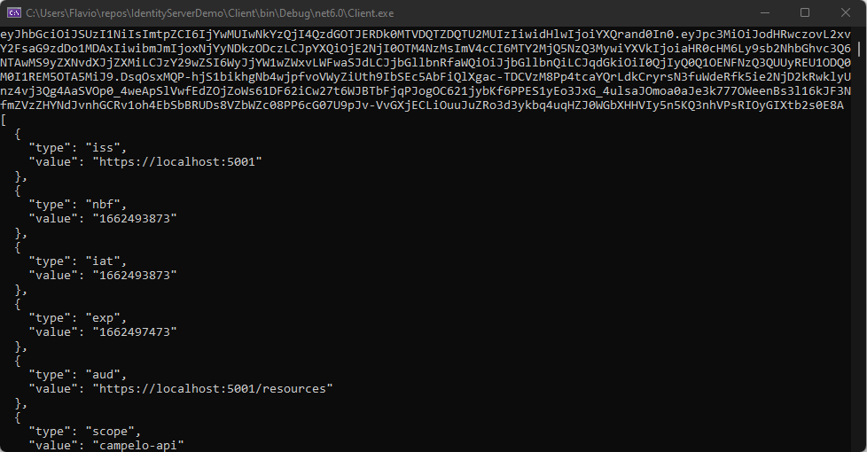

###### :postbox: Contact :brazil: :us: :fr:

[Twitter](https://twitter.com/campelo87)
[LinkedIn](https://www.linkedin.com/in/flavio-campelo/?locale=en_US)

---

This is an example of how to a client application retrieves a token from a Identity Server and use it in an WebApi to consumes an endpoint.

# How this project was created
This example was built based on [Duende documentation](https://docs.duendesoftware.com/identityserver/v6/quickstarts/1_client_credentials/)

#Identity Server
Identity provider for our sample.

## Install Duende templates
# ```powershell
dotnet new --install Duende.IdentityServer.Templates
```

## Create an empty solution
```powershell
dotnet new sln -n IdentityServerDemo
```

## Create Identity server project
```powershell
dotnet new isempty -n IdentityServer
```

## Add IdendityServer projet to the blank solution
```powershell
dotnet sln add .\IdentityServer\IdentityServer.csproj
```

## Add scope to config.cs
```csharp
public static IEnumerable<ApiScope> ApiScopes =>
	new ApiScope[]
		{ new ApiScope(name: "campelo-api", displayName: "CampeloAPI") };
```

## Add client to config.cs
```csharp
public static IEnumerable<Client> Clients =>
	new Client[]
		{ new Client
		{
			ClientId = "client",
			// no interactive user, use the clientid/secret for authentication
			AllowedGrantTypes = GrantTypes.ClientCredentials,
			// secret for authentication
			ClientSecrets =
			{
				new Secret("secret".Sha256())
			},
			// scopes that client has access to
			AllowedScopes = { "campelo-api" }
		} };
```

## Openid-configuration
Now you can access openid-configuration from the identity server. Run the solution and go to [https://localhost:5001/.well-known/openid-configuration](https://localhost:5001/.well-known/openid-configuration). So you can retrieve something like this.

```json
{
   "issuer":"https://localhost:5001",
   "jwks_uri":"https://localhost:5001/.well-known/openid-configuration/jwks",
   "authorization_endpoint":"https://localhost:5001/connect/authorize",
   "token_endpoint":"https://localhost:5001/connect/token",
   "userinfo_endpoint":"https://localhost:5001/connect/userinfo",
   "end_session_endpoint":"https://localhost:5001/connect/endsession",
   "check_session_iframe":"https://localhost:5001/connect/checksession",
   "revocation_endpoint":"https://localhost:5001/connect/revocation",
   "introspection_endpoint":"https://localhost:5001/connect/introspect",
   "device_authorization_endpoint":"https://localhost:5001/connect/deviceauthorization",
   "backchannel_authentication_endpoint":"https://localhost:5001/connect/ciba",
   "frontchannel_logout_supported":true,
   "frontchannel_logout_session_supported":true,
   "backchannel_logout_supported":true,
   "backchannel_logout_session_supported":true,
   "scopes_supported":[
      "openid",
      "campelo-api",
      "offline_access"
   ],
   "claims_supported":[
      "sub"
   ],
   "grant_types_supported":[
      "authorization_code",
      "client_credentials",
      "refresh_token",
      "implicit",
      "urn:ietf:params:oauth:grant-type:device_code",
      "urn:openid:params:grant-type:ciba"
   ],
   "response_types_supported":[
      "code",
      "token",
      "id_token",
      "id_token token",
      "code id_token",
      "code token",
      "code id_token token"
   ],
   "response_modes_supported":[
      "form_post",
      "query",
      "fragment"
   ],
   "token_endpoint_auth_methods_supported":[
      "client_secret_basic",
      "client_secret_post"
   ],
   "id_token_signing_alg_values_supported":[
      "RS256"
   ],
   "subject_types_supported":[
      "public"
   ],
   "code_challenge_methods_supported":[
      "plain",
      "S256"
   ],
   "request_parameter_supported":true,
   "request_object_signing_alg_values_supported":[
      "RS256",
      "RS384",
      "RS512",
      "PS256",
      "PS384",
      "PS512",
      "ES256",
      "ES384",
      "ES512",
      "HS256",
      "HS384",
      "HS512"
   ],
   "authorization_response_iss_parameter_supported":true,
   "backchannel_token_delivery_modes_supported":[
      "poll"
   ],
   "backchannel_user_code_parameter_supported":true
}
```

# API project
Web API project.

## Create a new web API project
```powershell
dotnet new webapi -n WebApi
```

## Adding webapi to the solution
```powershell
dotnet sln add .\WebApi\WebApi.csproj
```

## Adding JWT Bearer authentication
```powershell
dotnet add .\WebApi\WebApi.csproj package Microsoft.AspNetCore.Authentication.JwtBearer
```

## Set JWT Bearer as the default authentication scheme
Update the Program.cs or Startup.cs file.
```csharp
builder.Services.AddAuthentication("Bearer")
    .AddJwtBearer("Bearer", options =>
    {
        options.Authority = "https://localhost:5001";

        options.TokenValidationParameters = new TokenValidationParameters
        {
            ValidateAudience = false
        };
    });
	
/// UseAuthentication right before UseAuthorization
app.UseAuthentication();
app.UseAuthorization();
```

## Add a new controller for testing
```csharp
[Route("identity")]
[Authorize]
public class IdentityController : ControllerBase
{
	[HttpGet]
	public IActionResult Get()
	{
		return new JsonResult(from c in User.Claims select new { c.Type, c.Value });
	}
}
```

## Configure the WebAPI to listen on Port 6001
Edit the launchSettings.json file in Properties folder.
```json
"applicationUrl": "https://localhost:6001"
```

## Run the WebAPI project
Now you have a 401 (unauthorized) error response when trying to access [https://localhost:6001/identity](https://localhost:6001/identity)

# Client project

## Create a console client project
```powershell
dotnet new console -n Client
```

## Add the client project to the solution
```powershell
dotnet sln add .\Client\Client.csproj
```

## Add IdentityModel to the client project
```powershell
dotnet add .\Client\Client.csproj package IdentityModel
```

## Discover endpoints from metadata
```csharp
var client = new HttpClient();
var disco = await client.GetDiscoveryDocumentAsync("https://localhost:5001");
if (disco.IsError)
{
    Console.WriteLine(disco.Error);
    return;
}
```

## Request token
```csharp
var tokenResponse = await client.RequestClientCredentialsTokenAsync(new ClientCredentialsTokenRequest
{
    Address = disco.TokenEndpoint,

    ClientId = "client",
    ClientSecret = "secret",
    Scope = "campelo-api"
});

if (tokenResponse.IsError)
{
    Console.WriteLine(tokenResponse.Error);
    return;
}

Console.WriteLine(tokenResponse.AccessToken);
```

## Call WebAPI
```csharp
var apiClient = new HttpClient();
apiClient.SetBearerToken(tokenResponse.AccessToken);

var response = await apiClient.GetAsync("https://localhost:6001/identity");
if (!response.IsSuccessStatusCode)
{
    Console.WriteLine(response.StatusCode);
}
else
{
    var doc = JsonDocument.Parse(await response.Content.ReadAsStringAsync()).RootElement;
    Console.WriteLine(JsonSerializer.Serialize(doc, new JsonSerializerOptions { WriteIndented = true }));
}
```

## Run client
Be sure that the IdentityServer and WebAPI are running and run the Client project to see something like this


# Source code
[Source code](https://github.com/campelo/IdentityServerDemo)

## Typos or suggestions?

If you've found a typo, a sentence that could be improved or anything else that should be updated on this blog post, you can access it through a git repository and make a pull request. If you feel comfortable with github, instead of posting a comment, please go directly to https://github.com/campelo/documentation and open a new pull request with your changes.