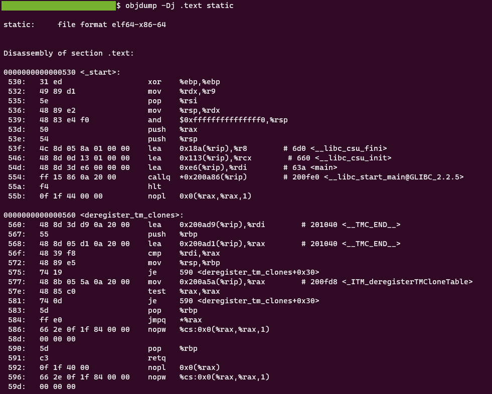

###### :postbox: Contact :brazil: :us: :fr:

[Twitter](https://twitter.com/campelo87)
[LinkedIn](https://www.linkedin.com/in/flavio-campelo/?locale=en_US)

---
# Content

  - [binwalk](#binwalk)
  - [objdump](#objdump)
  - [strings](#strings)
  - [exiftool](#exiftool)
  - [vim](#vim)
  - [xxd](#xxd)
  - [stat](#stat)
  - [file](#file)
  - [unzip](#unzip)
  - [curl](#curl)
  - [wget](#wget)
  
## binwalk

The fastest way to check for embedded files and executable code

```bash
binwalk file.txt
```


[objdump](https://www.kali.org/tools/binwalk/) in kali tools

## objdump

Can display some important information from a file like its assembler mnemonics for the machine instructions

```bash
objdump -D file.bin
```



[man objdump](https://man7.org/linux/man-pages/man1/objdump.1.html)

## strings

It prints a sequence of printable caracteres from a file

```bash
strings -a file.txt
```


[man strings](https://man7.org/linux/man-pages/man1/strings.1.html)

## exiftool

Read and write meta information in files

```bash
exiftool file.txt
```


[man exiftool](https://linux.die.net/man/1/exiftool)

## vim

A powerful text editor.

```bash
vim file.txt
```

You can use vim to combine commands to edit a file. 

For example, you can format a SQL query using **sqlformat**...

```bash
vim sqlFile.txt
:%! sqlformat --reindent --keywords upper --identifiers lower
```

...or edit the hexcode of a file using **xxd**

```bash
vim file.txt
:%! xxd
```


[vim range tips](https://vim.fandom.com/wiki/Ranges)

## xxd

Used to see or modify the hex dump from a file.

```bash
xxd file.txt
```

[man xxd](https://linux.die.net/man/1/xxd)

## stat

It displays information about the file

```bash
stat file.txt
```

[man stat](https://man7.org/linux/man-pages/man2/lstat.2.html)

## file 

Determine the file type

```bash
stat file.txt
```


[man file](https://man7.org/linux/man-pages/man1/file.1.html)

## unzip

Commonly used to extract files from a zip file.

```bash
unzip file.zip
```

[man unzip](https://linux.die.net/man/1/unzip)

## curl

You can use it to transfer data from or to a server.

```bash
curl http://mysite.com -H "Authorization: Bearer token"
```

```bash
curl -X POST http://mysite.com -H "Authorization: Bearer token" -d "{ 'data': 'something' }"
```

```bash
curl -I HEAD http://mysite.com
```

[man curl](https://man7.org/linux/man-pages/man1/curl.1.html)

## wget

Download web files from internet.

```bash
wget http://mysite.com/file
```

[man wget](https://linux.die.net/man/1/wget)


## Typos or suggestions?

If you've found a typo, a sentence that could be improved or anything else that should be updated on this blog post, you can access it through a git repository and make a pull request. If you feel comfortable with github, instead of posting a comment, please go directly to https://github.com/campelo/documentation and open a new pull request with your changes.
