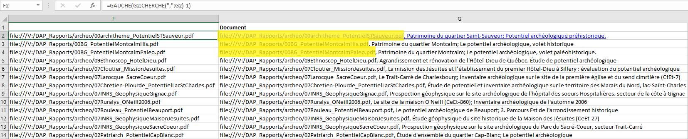
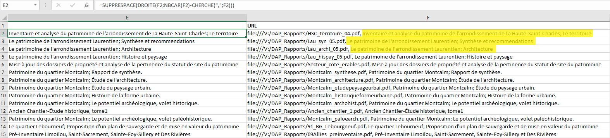
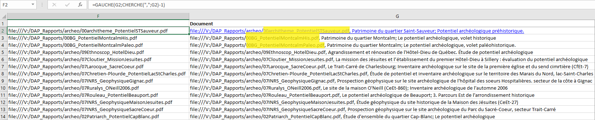
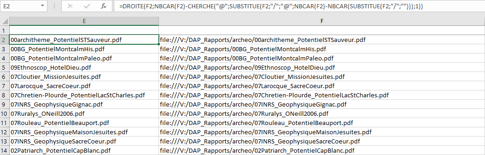

If you're trying to get a part of a text from a excel's cell, this post can help you with a few samples.
For all examples we need a delimited char to split our text in two parts, nedeed and needless.

## Text on the left
For this example, the comma <strong>,</strong> is our delimited char. Now, you can eliminate all right side (needless text).

```
=FIND(G2,FIND(",",G2)-1)
```



## Text on the right
For this example, the comma <strong>,</strong> is our delimited char.

```
=FIND(",",F2)
```

Get all right text (needed text) from that char.
```
=RIGHT(F2,LEN(F2)-FIND(",",F2))
```

Use <strong>trim</strong> function to remove needless spaces
```
=TRIM(RIGHT(F2,LEN(F2)-FIND(",",F2)))
```




## Text on the middle
For that, you have to combine both of previous actions (left + right).


First of all you could eliminate the [right needless part](#text-on-the-left) of the text.

Then we will eliminate all left side from searched text. On our example, we will use slash char <strong>/</strong> to split our text.
```
=RIGHT(F2,LEN(F2)-FIND("@",SUBSTITUTE(F2,"/","@",LEN(F2)-LEN(SUBSTITUTE(F2,"/",""))),1))
```


## Sources:

[Substring](https://www.excel-easy.com/examples/substring.html#:~:text=To%20extract%20the%20leftmost%20characters,correct%20number%20of%20leftmost%20characters.)

[Getting the last position of a character using excel formula](https://trumpexcel.com/find-characters-last-position/)

## Typos or suggestions?

If you've found a typo, a sentence that could be improved or anything else that should be updated on this blog post, you can access it through a git repository and make a pull request. Instead of posting a comment, please go directly to https://github.com/campelo/documentation and open a new pull request with your changes.
