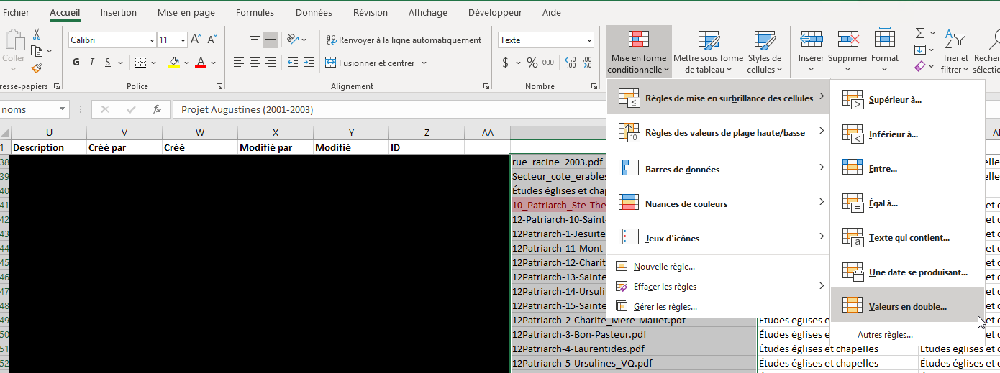
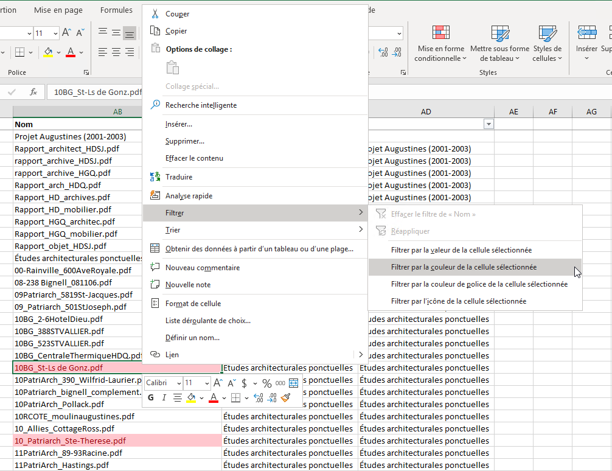
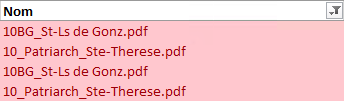
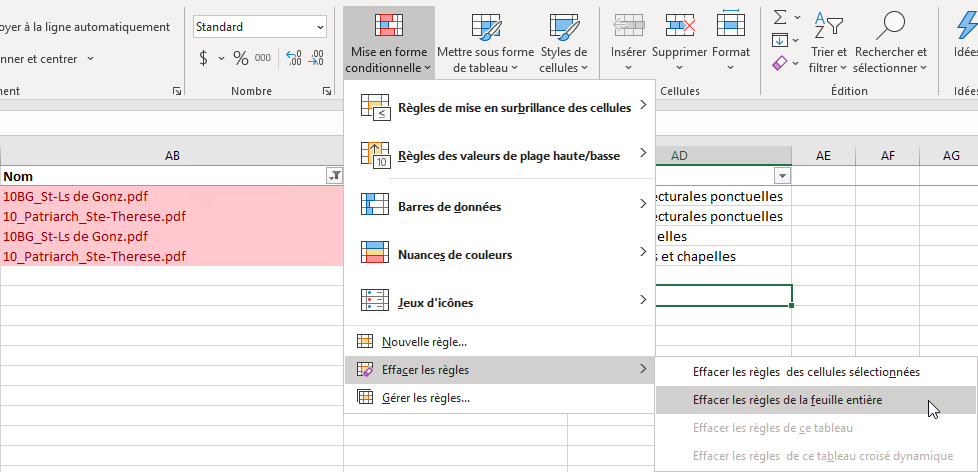

###### :postbox: Contact :brazil: :us: :fr:

[Twitter](https://twitter.com/campelo87)
[LinkedIn](https://www.linkedin.com/in/flavio-campelo/?locale=en_US)

---

If you're looking for duplicated values in a excel sheet, you can find them easily.

## Identifying duplicate values

We need to select the columns or cells that have duplicate values and select Home > Conditional Formatting > Highlight Cells Rules > Duplicate Values

After that we could right-click on one of the duplicate cells and choose Filter > Filter by Selected Cell's Color

All duplicated cells will be filtered

To clear conditional filter, choose Conditional Formatting > Clear Rules > Clear Rules from Entire Sheet

Sources:

[Duplicate values](https://www.accountingweb.com/technology/excel/identifying-duplicate-values-in-an-excel-list)

## Typos or suggestions?

If you've found a typo, a sentence that could be improved or anything else that should be updated on this blog post, you can access it through a git repository and make a pull request. If you feel comfortable with github, instead of posting a comment, please go directly to https://github.com/campelo/documentation and open a new pull request with your changes.
