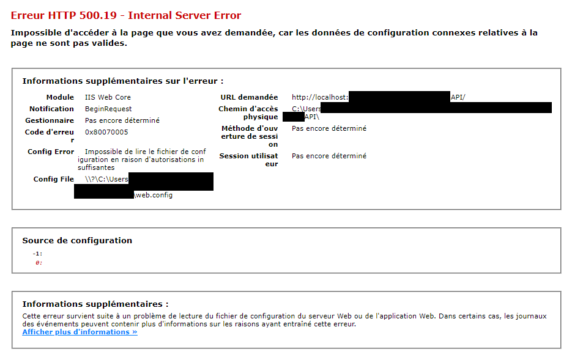

###### :postbox: Contact :brazil: :us: :fr:

[Twitter](https://twitter.com/campelo87)
[LinkedIn](https://www.linkedin.com/in/flavio-campelo/?locale=en_US)

---

## 500.19-IIS error when running web application

Maybe you're trying to run an web application from VS in a company domain and then you find this error:

The problem is about the authorizations to the user which is running the application pool on IIS. That user doesn't have access to the web.config file in the project's directory.

So, you have to find the **web.config** file and give access to that user.

When you find the file, **right-click** it and then click on **Properties** and finally open the **Security** tab. You have to add a new authorization to the **IIS_IUSRS** group. *This is a local group so, if you're in a **domain**, you must to select your **local computer** to find it.*

## IIS_IUSRS group

Every user (service network, local system, etc) that your website uses. See [microsoft documentation](https://docs.microsoft.com/en-US/troubleshoot/developer/webapps/iis/www-authentication-authorization/understanding-identities#:~:text=IUSR%20%E2%80%93%20anonymous%20authentication%20Anonymous%20authentication%20allows%20users,This%20built-in%20account%20does%20not%20require%20a%20password.) for further details.

## Typos or suggestions?

If you've found a typo, a sentence that could be improved or anything else that should be updated on this blog post, you can access it through a git repository and make a pull request. If you feel comfortable with github, instead of posting a comment, please go directly to https://github.com/campelo/documentation and open a new pull request with your changes.