###### :postbox: Contact :brazil: :us: :fr:

[Twitter](https://twitter.com/campelo87)
[LinkedIn](https://www.linkedin.com/in/flavio-campelo/?locale=en_US)

---

# Creating a shared calendar (calendar group)

## Before starting

This sample was created in an [Office 365](https://www.office.com/) environment.

Some permissions is needed for creating new Microsoft 365 groups. Further informations on [this Microsoft documentation](https://docs.microsoft.com/en-us/microsoft-365/admin/email/create-edit-or-delete-a-security-group?view=o365-worldwide)

## Adding new calendar group

You can access [Outlook 365](https://outlook.office.com/calendar) and click the calendar icon on left nav panel

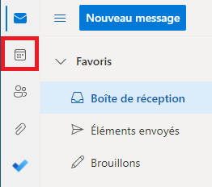

On **Groups** section, click ellipsis icon then new group

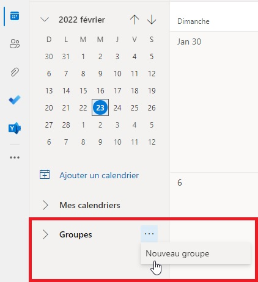

A new window will be displayed to enter the new group's name, address and other informations.

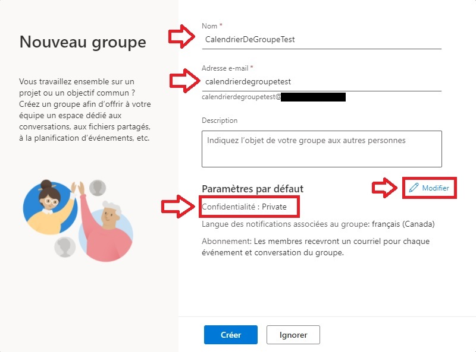

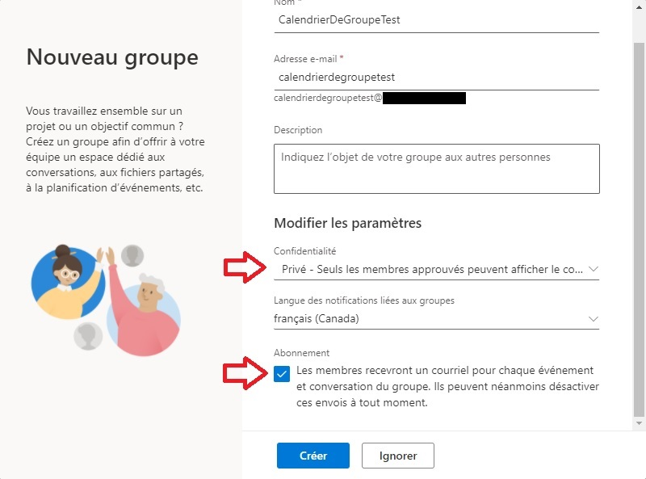

Under Privacy, you can choose if the new group will be **private** (only group members can see its content) or **public** (all members of your organization can see its content).

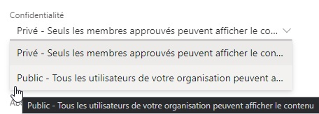

If all is done, you can hit the **Create** button.

You might see a message like that.

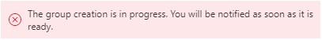

## Adding new members to new group

You can access [Azure Portal](https://portal.azure.com/) and open Azure Active Directory service to manage your groups.

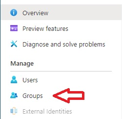

The new group will be showed in the main list.

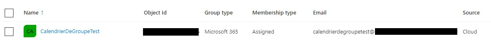

When you click the group's name, you can manage its members, owners and other properties. So, click **Members** on the left pane and then **Add members**.

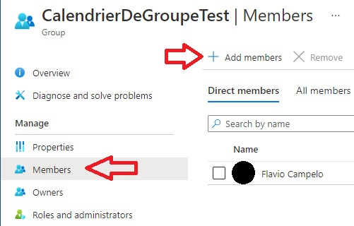

Search for new members.

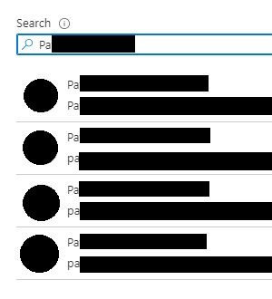

## Creating a new event on the calendar group

Come back to your calendar's page and check the new group. After that you will be able to create and see all events from this calendar.

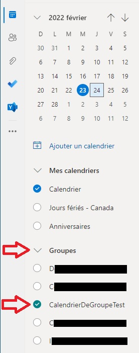

When you create a new event, you can choose which calendar you're creating for.

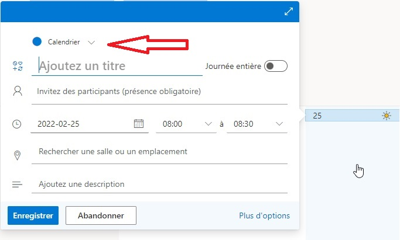

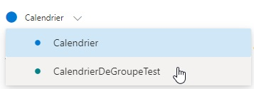

You will see a message to remember you that any invitation will be sent to group's member. Everyone will be able to see the event anyway.

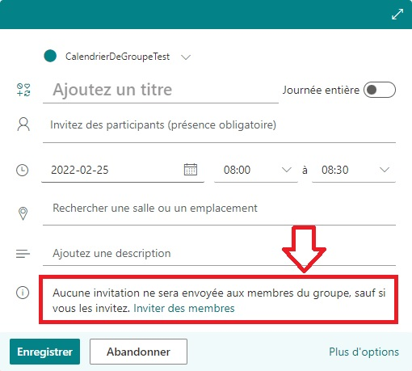

I've created two invitations for this sample. 

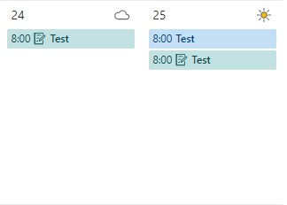

For the first one, 24th, I invited someone else. So, I can see a green event for this group. 

The second sample, 25th, I invited myself. So, I received an invitation on my personnal calendar (the blue one) and I still seeing the group's event for that day (the green one).

## Typos or suggestions?

If you've found a typo, a sentence that could be improved or anything else that should be updated on this blog post, you can access it through a git repository and make a pull request. If you feel comfortable with github, instead of posting a comment, please go directly to https://github.com/campelo/documentation and open a new pull request with your changes.