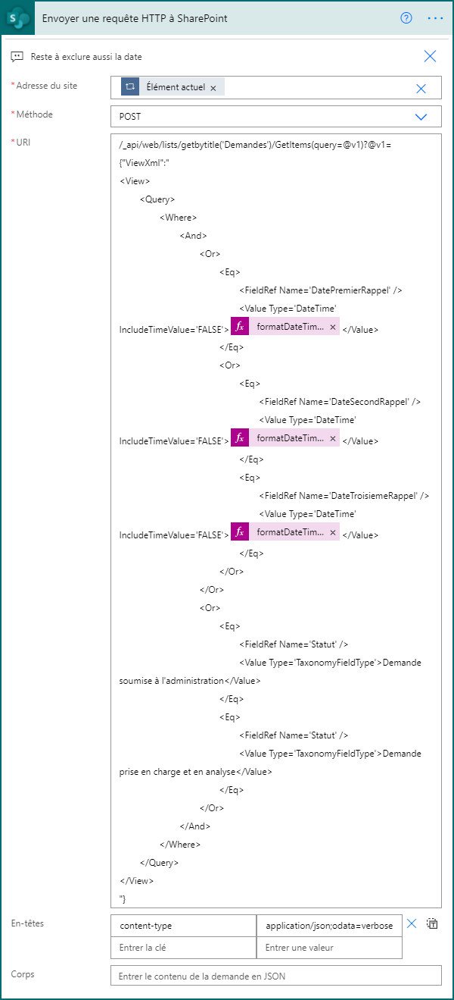

Using **Sent an HTTP request to SharePoint** action, it's possible to get filtered items using ODATA query string. But if you use termset taxonomy, you could use a xml to send that filter conditions.

Each condition it's analysed by pair. So, there isn't an **AND** or **OR** with three or more conditions inside them. For that, you should use subgroups of pair conditions.

In this exemple, we would get all items that one of date fields (FirstDate, SecondDate, ThirdDate) is today. So, we must to create **OR** subgroups with max of 2 conditions each.

```xml
/_api/web/lists/getbytitle('ListName')/GetItems(query=@v1)?@v1={"ViewXml":"
<View>
	<Query>
		<Where>
			<And>
				<Or>
					<Eq>
						<FieldRef Name='FirstDate' />
						<Value Type='DateTime' IncludeTimeValue='FALSE'>@{formatDateTime(utcNow(),'yyyy-MM-dd')}</Value>
					</Eq>
					<Or>
						<Eq>
							<FieldRef Name='SecondDate' />
							<Value Type='DateTime' IncludeTimeValue='FALSE'>@{formatDateTime(utcNow(),'yyyy-MM-dd')}</Value>
						</Eq>
						<Eq>
							<FieldRef Name='ThirdDate' />
							<Value Type='DateTime' IncludeTimeValue='FALSE'>@{formatDateTime(utcNow(),'yyyy-MM-dd')}</Value>
						</Eq>
					</Or>
				</Or>
				<Or>
					<Eq>
						<FieldRef Name='Status' />
						<Value Type='TaxonomyFieldType'>Termset name 1</Value>
					</Eq>
					<Eq>
						<FieldRef Name='Status' />
						<Value Type='TaxonomyFieldType'>Termset name 2</Value>
					</Eq>
				</Or>
			</And>
		</Where>
	</Query>
</View>
"}
```

An important tip is that the complex conditions is more difficult to be computed. For better performances, it's suggested to use simple conditions first and complex ones after. Like as the example, we use the date conditions first and termset conditions after those ones.



## Typos or suggestions?

If you've found a typo, a sentence that could be improved or anything else that should be updated on this blog post, you can access it through a git repository and make a pull request. Instead of posting a comment, please go directly to https://github.com/campelo/documentation and open a new pull request with your changes.