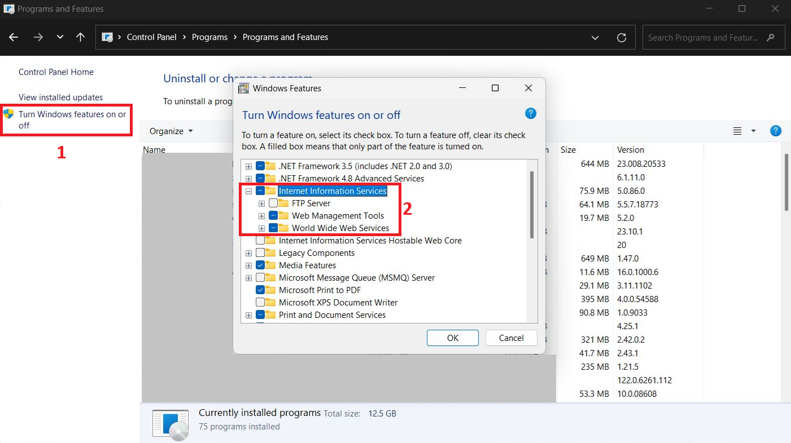

###### :postbox: Contact :brazil: :us: :fr:

[Twitter](https://twitter.com/campelo87)
[LinkedIn](https://www.linkedin.com/in/flavio-campelo/?locale=en_US)

---

# Backend App (ASP.NET Core)

## Enabling IIS features on windows

If you don't have the IIS enabled yet, you can turn it on. Open control panel or run the command.
```powershell
appwiz.cpl
```


## Publishing on IIS

You can use [this documentation](https://docs.microsoft.com/en-us/dotnet/core/deploying/) for publishing by command line or [this one](https://docs.microsoft.com/en-us/dotnet/core/tools/dotnet-publish) to know more about **dotnet publish** command.

### Examples

```powershell
# publishing to linux-x64
dotnet publish -r linux-x64 --self-contained true

# publishing to win-x64 ready to run app
dotnet publish -c Release -r win-x64 --self-contained true -p:PublishReadyToRun=true

# publishing using a profile
dotnet publish -p:PublishProfile=FolderProfile
```

You can also set a runtime identifier to your app for some of your .csproj files


You should to install [Hosting Bundle](https://dotnet.microsoft.com/en-us/download/dotnet/thank-you/runtime-aspnetcore-3.1.22-windows-hosting-bundle-installer) to use an asp.net core app on IIS.

Be sure to host your app as a **sub-application** or a **new web application** because [iis virtual directory](#for-error-500) isn't allowed for hosting an ASP.NET Core app.

### Enabling SSL to use HTTPS

On IIS Manager you can use a certificate to enable IIS. Here's a sample of how to [create a certificate](https://enterprise.arcgis.com/en/web-adaptor/10.3/install/iis/enable-https-on-your-web-server-server-.htm).

It's recommended to use a valid certificate from a trusted authority in production. Then you can select your application and a certificate as identified by the following image:


After that, you can change your settings to require SSL.


## Troubleshoot

### For error 403.16 

If you have a 403.16 error with a message like *The client certificate used for this request is not trusted by the Web server.*, you can use [this documentation](https://docs.microsoft.com/en-us/troubleshoot/developer/webapps/iis/health-diagnostic-performance/http-403-forbidden-access-website) to help you to configure your certificates.

### For error 500 

If you try to use an ASP.NET Core as a virtual directory, you will probably have this issue. So, be sure you're using a **sub-application** or a new **web application** instead. Read [this microsoft documentation](https://docs.microsoft.com/en-us/aspnet/core/host-and-deploy/iis/?view=aspnetcore-3.1#virtual-directories) for further details. 


# Frontend App (Angular)

## Publishing on IIS

There are sereral parameters to build an application in production. [Angular deployment documentation](https://angular.io/guide/deployment) could show you more options about that. 

You can add a new line in the package.json file to create a new alias for the command like that: 


And then, run this command.

```shell
npm run prod
```

Or execute the full command in the command line. For the both options, the results will be the same.

```shell
ng build -c production --base-href /my-app/
```

**my-app** modifies the base element in the index.html


You should have a web application or a virtual directory with the same alias name


## Installing URL Rewrite

To support deep-linking, capability to navigate directly to a page by typing the url into the address bar instead of using Angular routing, we should to install [URL Rewrite](https://www.iis.net/downloads/microsoft/url-rewrite). Deep-linking causes a problem for IIS because the URL that the user attempts to access is not known to the server and therefore the user receives a 404 response. The solution is for the server to always return the root of the application, even if the user requests a path within the application.

[Angular on iis](https://devblogs.microsoft.com/premier-developer/tips-for-running-an-angular-app-in-iis/)

Then, you can create a new web.config file with the content below:

```xml
<configuration>
<system.webServer>
  <rewrite>
    <rules>
      <rule name="Angular Routes" stopProcessing="true">
        <match url=".*" />
        <conditions logicalGrouping="MatchAll">
          <add input="{REQUEST_FILENAME}" matchType="IsFile" negate="true" />
          <add input="{REQUEST_FILENAME}" matchType="IsDirectory" negate="true" />
        </conditions>
        <action type="Rewrite" url="/my-app/" />
      </rule>
    </rules>
  </rewrite>
</system.webServer>
</configuration>
```

You can also add a web.config file to your angular project. And then, insert a new line in your angular.json file that points to this new file under *project name &rarr; architect &rarr; build &rarr; options &rarr; assets*.


## Typos or suggestions?

If you've found a typo, a sentence that could be improved or anything else that should be updated on this blog post, you can access it through a git repository and make a pull request. If you feel comfortable with github, instead of posting a comment, please go directly to https://github.com/campelo/documentation and open a new pull request with your changes.
