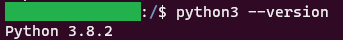
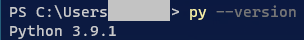
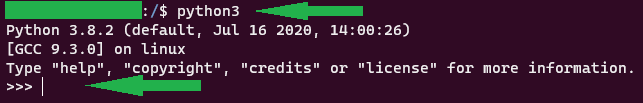
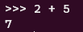
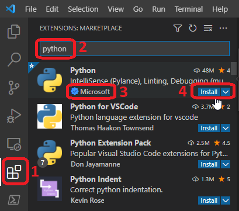
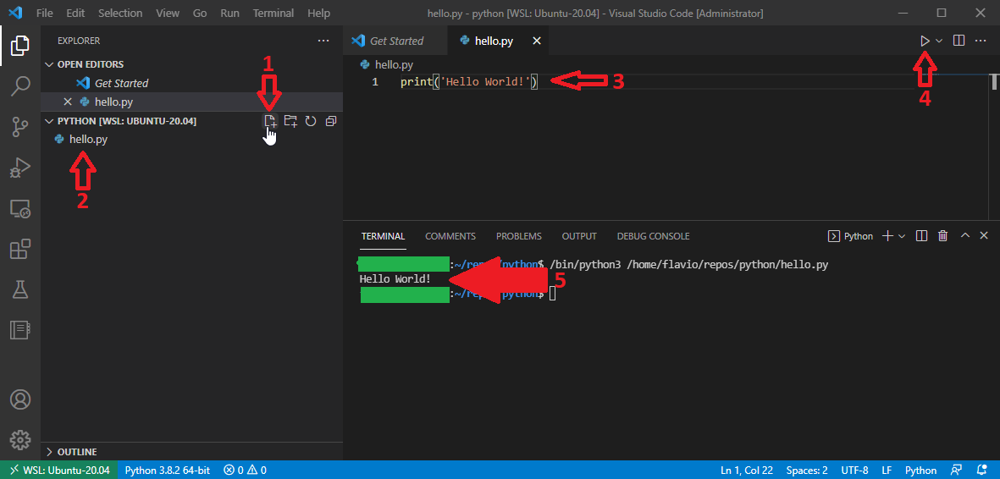

###### :postbox: Contact :brazil: :us: :fr:

[Twitter](https://twitter.com/campelo87)
[LinkedIn](https://www.linkedin.com/in/flavio-campelo/?locale=en_US)

---

## Why should you choose Python?

Python is a modern program language and it's easy to learn. You can use it in a variety of solutions like data science, machine learning, web development, GUI development, iot, and others. There's a strong [Python community](https://www.python.org/community/) that supports this language.

## How to install Python?

Python is already available by default for the most of Linux and UNIX distributions. If you're using windows OS, it's possible to use [Windows Subsystem for Linux](https://docs.microsoft.com/en-us/windows/wsl/about) aka **WSL** to use your favorite linux distribution in your machine. It's really easy to do this. Read the [Microsoft official documentation](https://docs.microsoft.com/en-us/windows/wsl/install) to know how to install it.

If you prefer to install pyhton, you can see further informations [here](https://wiki.python.org/moin/BeginnersGuide/Download).

You can run this command to confirm that Python is installed

**For UNIX or Linux distros**

```
python3 --version
```



**For Windows**

```
py --version
```



## Start using Python

You should to consider the command **python3** for *UNIX* or *Linux* distros and **py** for *Windows*

You can use the command line to execute Python like this.

```
python3
``` 



And then, you can start coding like that

```
2 + 5
```



## Using an IDE

I really suggest you to use a modern IDE for coding. For this example I'll use [Visual Studio Code](https://code.visualstudio.com/download) aka **VSCode**, but you can choose another one. Python website has a [page to show you some recommended IDEs](https://wiki.python.org/moin/IntegratedDevelopmentEnvironments) to use.

When VSCode is installed, you can click on *Extensions icon* and type *Python* on search bar. Then you can click install under *Python* extension developped by Microsoft.



Now you able to write your first code. For that you can create a new file called **hello.py**. Insert the a code inside this file. ```print ('Hello world!')``` and run it to see the result on the terminal.



###### Notes

- You can access this code on [github](https://github.com/campelo/Python-First-steps).
- **py** extension is either called a python program or python script.

## Typos or suggestions?

If you've found a typo, a sentence that could be improved or anything else that should be updated on this blog post, you can access it through a git repository and make a pull request. If you feel comfortable with github, instead of posting a comment, please go directly to https://github.com/campelo/documentation and open a new pull request with your changes.
