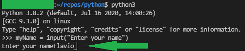
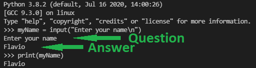

###### :postbox: Contact :brazil: :us: :fr:

[Twitter](https://twitter.com/campelo87)
[LinkedIn](https://www.linkedin.com/in/flavio-campelo/?locale=en_US)

---

## Variables

Computer programs use variables to hold and work with values in memory. For this reason it's important to know a little bit more about them.

### Keeping hard coded values

This sample shows how to print a calculated value to the user

```python
myNumber = 2
print(myNumber)
```

### Getting value from user input

Most of the time, the program will wait or ask the user to input values. To do this with python is very simple. We'll use **input()** function for that.

```python
myNumber = input("Enter a number: ")
print(myNumber)
```

### Breaking line

Using this code below, the program will wait for a value from the user.

```python
myName = input("Enter your name")
print(myName)
```

The issue here is that the user's response will be concatenated directly with the question. 



To solve that, we can use [escape characters](https://www.w3schools.com/python/gloss_python_escape_characters.asp) to insert a new line **\n**.

```python
myName = input("Enter your name\n")
print(myName)
```

Now, the question will be showed in one line and the answer in another one.



###### Notes

You can access this code on [github](https://github.com/campelo/Python-First-steps).

## Typos or suggestions?

If you've found a typo, a sentence that could be improved or anything else that should be updated on this blog post, you can access it through a git repository and make a pull request. If you feel comfortable with github, instead of posting a comment, please go directly to https://github.com/campelo/documentation and open a new pull request with your changes.
