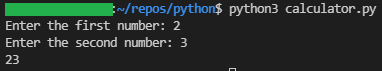
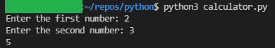
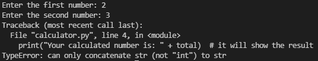
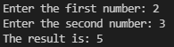

###### :postbox: Contact :brazil: :us: :fr:

[Twitter](https://twitter.com/campelo87)
[LinkedIn](https://www.linkedin.com/in/flavio-campelo/?locale=en_US)

---

## Calculator sample

Create a new file called Calculator.py and add this code

```python
firstNumber = input("Enter the first number: ") # it will wait user input for the first number
secondNumber = input("Enter the second number: ")  # it will wait user input for the second number
total = firstNumber + secondNumber # it will keep the result in a variable called total
print(total)  # it will show the result
```

To execute this python program you can execute it with the command

```bash
python3 calculator.py
```



Here we have a problem. 2 + 3 is 5, so why the output is showing 23? It happens because anything received by the **input** il will be always a string type. It's the same as writing this ```firstNumber = "2"``` instead of this ```firstNumber = 2```

So, we have to convert the received input to a number.

```python
firstNumber = int(input("Enter the first number: ")) # it will wait user input for the first number
secondNumber = int(input("Enter the second number: "))  # it will wait user input for the second number
total = firstNumber + secondNumber # it will keep the result in a variable called total
print(total)  # it will show the result
```

And then, we have the correct answer:



What about improving the answer message? We would like to show a message like **The result is:** beside of the result. So, here is our new code:

```python
firstNumber = int(input("Enter the first number: ")) # it will wait user input for the first number
secondNumber = int(input("Enter the second number: "))  # it will wait user input for the second number
total = firstNumber + secondNumber # it will summarize
print("The result is: " + total)  # it will show the result
```

If we try to execute it, we get an error **TypeError: can only concatenate str (not "int") to str**. 



It happens because python can't concatenate **string** and **integer** types directly. So, we have to convert the **int** variable to **string** before show the message. Our new code will look like that:

```python
firstNumber = int(input("Enter the first number: ")) # it will wait user input for the first number
secondNumber = int(input("Enter the second number: "))  # it will wait user input for the second number
total = firstNumber + secondNumber # it will summarize
print("The result is: " + str(total))  # it will show the result
```

And everything is correct now.



###### Notes

You can access this code on [github](https://github.com/campelo/Python-First-steps).

## Typos or suggestions?

If you've found a typo, a sentence that could be improved or anything else that should be updated on this blog post, you can access it through a git repository and make a pull request. If you feel comfortable with github, instead of posting a comment, please go directly to https://github.com/campelo/documentation and open a new pull request with your changes.
