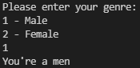
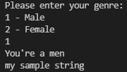
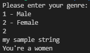
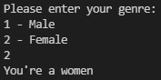
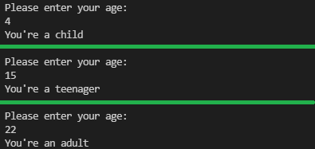
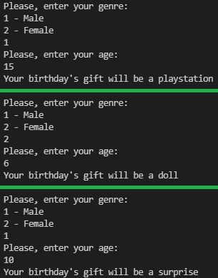

###### :postbox: Contact :brazil: :us: :fr:

[Twitter](https://twitter.com/campelo87)
[LinkedIn](https://www.linkedin.com/in/flavio-campelo/?locale=en_US)

---

## Using conditions

If you need to check some conditions to execute your code, you can use **if** statements. You can take a look on [Python Operators](https://www.w3schools.com/python/python_operators.asp) to know more about all types of operators for python.

```python
print("Please, enter your genre:")
print("1 - Male")
print("2 - Female")
genre = int(input())

if genre == 1:
  print("You're a men")
if genre == 2:
  print("You're a women")
```



It's important to know that after each statement we have to indent the statement content. Usually, two blank spaces is the default indent mark for python but you can customize it. It means that all indent code will be execute only if it satisfies the if condition. So, the two pieces of code below will be differents.

```python
if genre == 1:
  print("You're a men")
print("my sample string") # it will be always printed 
if genre == 2:
  print("You're a women")
```





```python
if genre == 1:
  print("You're a men")
  print("my sample string") # it will be only printed when genre equals 1
if genre == 2:
  print("You're a women")
```




Here we have another exemple to check if a person is an adult, child or a teenager.

```python
print("Please, enter your age:")
age = int(input())

if age < 13:
  print("You're a child")
elif age < 18:
  print("You're a teenager")
else:
  print("You're an adult")
```



You can combine multi conditions using logical operators like **and** and **or**

```python
print("Please, enter your genre:")
print("1 - Male")
print("2 - Female")
genre = int(input())

print("Please, enter your age:")
age = int(input())

if genre == 1 and age >= 12:
  print("Your birthday's gift will be a playstation")
elif genre == 2 and age < 10:
  print("Your birthday's gift will be a doll")
else:
  print("Your birthday's gift will be a surprise")
```



## Typos or suggestions?

<<<<<<< HEAD
If you've found a typo, a sentence that could be improved or anything else that should be updated on this blog post, you can access it through a git repository and make a pull request. If you feel comfortable with github, instead of posting a comment, please go directly to https://github.com/campelo/documentation and open a new pull request with your changes.
=======
If you've found a typo, a sentence that could be improved or anything else that should be updated on this blog post, you can access it through a git repository and make a pull request. If you feel comfortable with github, instead of posting a comment, please go directly to https://github.com/campelo/documentation and open a new pull request with your changes.
>>>>>>> origin/master
