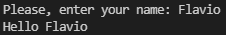
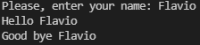
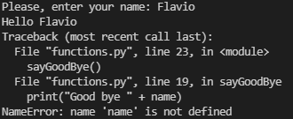

###### :postbox: Contact :brazil: :us: :fr:

[Twitter](https://twitter.com/campelo87)
[LinkedIn](https://www.linkedin.com/in/flavio-campelo/?locale=en_US)

---

## Why should I use a function?

Using functions, you can:
- reuse a piece of code over and over again just calling that function instead of rewriting all of the code again.
- organize your code by logical units.
- test or create test units for that specific function. Unit tests will help you to keep your code working regardless of future changes will code can receive.

## How can I write a function?

A function structure on python is written like this

```python
# Declaring a function...
def sayHello(name):
  print("Hello " + name)
```

- **def** - it's a reserved name to define a function
- **sayHello** - it's the name of the function
- **name** - it's a parameter used by the function

The function won't be called if we don't speficify this on the code. So, if we have a code like this, the function will be never called

```python
def sayHello(name):
  print("Hello " + name)

input_name = input("Please, enter your name: ")
```

So you can write your first sample like that:

```python
def sayHello(name):
  print("Hello " + name)

input_name = input("Please, enter your name: ")
# The function will only be called at this point...
sayHello(input_name)
```



## Global and local variables

In the sample before, the input_name variable is a global variable. So, we can reuse it everywhere on the code. We can exemplify using this code.

```python
def sayHello(name):
  print("Hello " + name) # using local variable...

def sayGoodBye():
  print("Good bye " + input_name)

input_name = input("Please, enter your name: ") # using global variable...
sayHello(input_name)
sayGoodBye()
```



The sayGoodBy function is using the **input_name** global variable to write an output to the user.

On the other hand, the name variable is only available in the sayHello function. That means that if we try to use the **name** variable inside the sayGoodBye function it won't work and we will receive an error informing that the **name** variable isn't defined neither locally nor globally.

```python
def sayHello(name):
  print("Hello " + name)

def sayGoodBye():
  print("Good bye " + name) # trying to use a nonexistent local variable...

input_name = input("Please, enter your name: ")
sayHello(input_name)
sayGoodBye()
```



## Typos or suggestions?

If you've found a typo, a sentence that could be improved or anything else that should be updated on this blog post, you can access it through a git repository and make a pull request. If you feel comfortable with github, instead of posting a comment, please go directly to https://github.com/campelo/documentation and open a new pull request with your changes.
