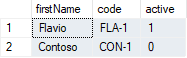

###### :postbox: Contact :brazil: :us: :fr:

[Twitter](https://twitter.com/campelo87)
[LinkedIn](https://www.linkedin.com/in/flavio-campelo/?locale=en_US)

---

## Declaring a variable with json content

Json content:
```json
[
  {
    "name": "Flavio",
    "code": "FLA-1",
    "isDeleted": false
  },
  {
    "name": "Contoso",
    "code": "CON-1",
    "isDeleted": true
  }
]
```

```sql
-- SET JSON CONTENT TO A VARIABLE (@JSON)...
DECLARE @json NVARCHAR(max) = N'[
    {
      "name": "Flavio",
      "code": "FLA-1",
      "isDeleted": false
    },
    {
      "name": "Contoso",
      "code": "CON-1",
      "isDeleted": true
    }
  ]';
```

## Fill a temp table with json content

```sql
-- FILL #TEMP TABLE WITH JSON CONTENT...
SELECT firstName, code, IIF(isDeleted = 1, 0, 1) as active 
	INTO #temp
	FROM OPENJSON(@json)
WITH  (
        firstName	VARCHAR(50) '$.name', 
        code		VARCHAR(10) '$.code',
		isDeleted	BIT			'$.isDeleted'
    );
```

## Show items from temp table

```sql
-- SHOW ITEMS FROM #TEMP TABLE
SELECT * FROM #temp;
```



## If you need to drop temp table

```sql
-- REMOVE A #TEMP TABLE...
DROP TABLE #temp;
```

## Typos or suggestions?

If you've found a typo, a sentence that could be improved or anything else that should be updated on this blog post, you can access it through a git repository and make a pull request. If you feel comfortable with github, instead of posting a comment, please go directly to https://github.com/campelo/documentation and open a new pull request with your changes.