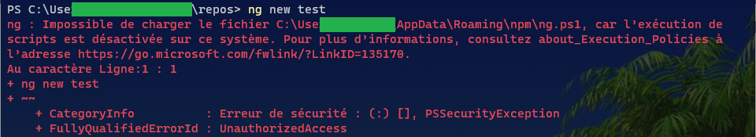
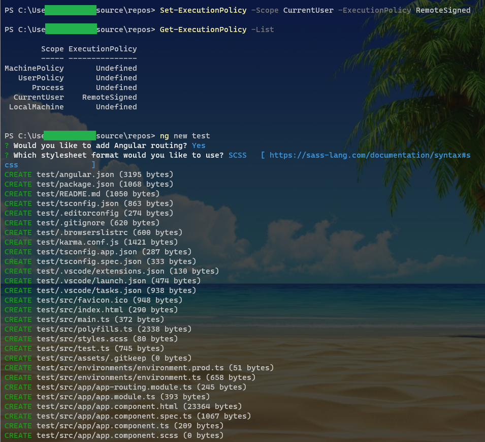

###### :postbox: Contact :brazil: :us: :fr:

[Twitter](https://twitter.com/campelo87)
[LinkedIn](https://www.linkedin.com/in/flavio-campelo/?locale=en_US)

---

## How to allow script execution on Windows

If you're trying to execute an script and you receive a message like that



You can change your policies manually to be able to execute them. 

```PowerShell
# This sample will enable the current user to execute all of signed scripts.
Set-ExecutionPolicy -Scope CurrentUser -ExecutionPolicy RemoteSigned
```



You can find further details about ExecutionPolicy on [this page](https://docs.microsoft.com/en-us/powershell/module/microsoft.powershell.security/set-executionpolicy) from the Microsoft documentation.

## Typos or suggestions?

If you've found a typo, a sentence that could be improved or anything else that should be updated on this blog post, you can access it through a git repository and make a pull request. If you feel comfortable with github, instead of posting a comment, please go directly to https://github.com/campelo/documentation and open a new pull request with your changes.
