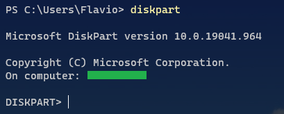
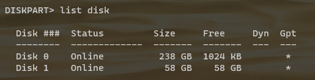

###### :postbox: Contact :brazil: :us: :fr:

[Twitter](https://twitter.com/campelo87)
[LinkedIn](https://www.linkedin.com/in/flavio-campelo/?locale=en_US)

---

## Disk management

- Type **disk management** on start menu, or 
- Right-click computer **manage > disk management**
- Open run window (**Win + R**), type **diskmgmt.msc** and press **Enter**.

Choose disk partition and click delete button. But for some EFI protected partitions, like this...

...you might see messages like below.

Then you can use a command line to fully format your disk.

## Diskpart

Open your command prompt or powershell as admin. And type **diskpart**

So you can type **list disk** to list all available disks.

Select the correct disk to format.

So you can type clean to erase all disk.

And now the disk is fully formated.

## Typos or suggestions?

If you've found a typo, a sentence that could be improved or anything else that should be updated on this blog post, you can access it through a git repository and make a pull request. If you feel comfortable with github, instead of posting a comment, please go directly to https://github.com/campelo/documentation and open a new pull request with your changes.