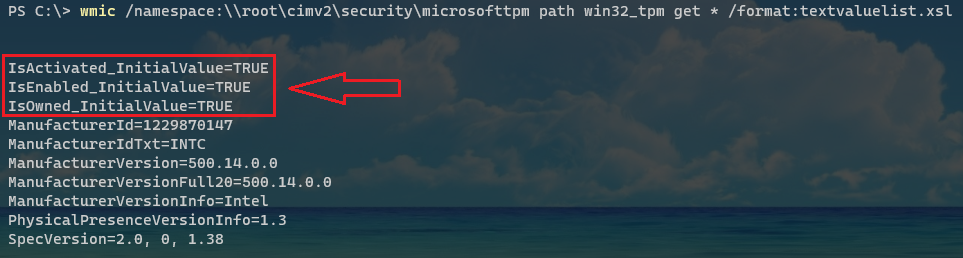

## TPM
[Trusted Platform Module (TPM)](https://docs.microsoft.com/en-us/windows/security/information-protection/tpm/trusted-platform-module-overview) is a hardware-based that provides physical security protection to your data. TPM version 2.0 is required for windows 11, the new version of windows.

## TPM on BIOS
Maybe your PC has the component but you might to enable or update its BIOS version to get ready to use it. So, you could check your PC factory's website to see how to activate it.

You can open the start menu and type **Sytem information** to check if **Secure Boot State** is turned on.


## Chaking TPM version
There are some examples of how to check your TPM version.

### Management tool
Open the Run dialog. You can use the *Win + R* shortcut for that. Type *tpm.msc* and *Enter*. 


If you have TPM on your PC you can see a new window with some informations. You should verify **Status** and **Specific version** under *TPM Manufacturer Information*. 


### Device manager
Open the Run dialog. You can use the *Win + R* shortcut for that. Type *devmgmt.msc* and *Enter*. 


Or right-clicking start menu button and then click on Device Manager.


Under **Security devices** you can find **Trusted Platform Module**. Right-click it and click on Properties to see a new window with more details.


### CMD or PowerShell
You can use CMD or PowerShell to check TPM. Open start menu and type *CMD* or *PowerShell* and run it as **Administrator**.

Use the following command to see more information.

```
wmic /namespace:\\root\cimv2\security\microsofttpm path win32_tpm get * /format:textvaluelist.xsl
```



To know if TPM is installed, all of three valeus must to be **TRUE** 
- IsActivated
- IsEnabled
- IsOwned

## Typos or suggestions?

If you've found a typo, a sentence that could be improved or anything else that should be updated on this blog post, you can access it through a git repository and make a pull request. If you feel comfortable with github, instead of posting a comment, please go directly to https://github.com/campelo/documentation and open a new pull request with your changes.
